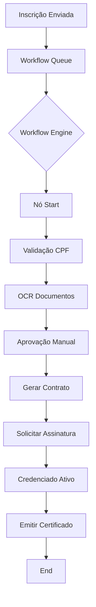
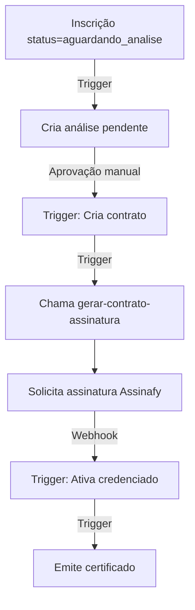

# Arquiteturas de Processamento: Workflow Engine vs Fluxo Programático

Este documento explica as duas arquiteturas disponíveis para processar inscrições de editais no sistema.

## Visão Geral

O sistema oferece **duas formas** de processar inscrições:

1. **Workflow Engine** (Recomendado para novos editais) - Orquestração visual com nós configuráveis
2. **Fluxo Programático** (Legacy) - Triggers e funções SQL que processam automaticamente

---

## 1. Workflow Engine (Arquitetura Moderna)

### O que é?
Um motor de workflow visual que permite criar fluxos de aprovação personalizados usando um editor drag-and-drop. Cada etapa é representada por um "nó" que pode executar ações como:
- Validações automatizadas (CPF, CRM, CNPJ)
- Análise de documentos com OCR
- Envio de emails
- Criação de registros no banco
- Solicitação de assinaturas eletrônicas
- Condicionais complexas

### Como funciona?


### Vantagens
✅ **Flexibilidade**: Cada edital pode ter um fluxo diferente  
✅ **Visibilidade**: Gestor vê onde cada inscrição está travada  
✅ **Auditoria**: Registra cada execução de nó com timestamps  
✅ **Retry**: Pode reprocessar inscrições que falharam  
✅ **Escalabilidade**: Processa em background via fila  
✅ **Observabilidade**: Logs detalhados de execução  

### Desvantagens
❌ Mais complexo de configurar inicialmente  
❌ Requer familiaridade com o editor de workflows  
❌ Overhead de processamento (mais lento que triggers)  

### Quando usar?
- ✅ Editais com regras complexas de validação
- ✅ Quando precisa de aprovação manual em etapas específicas
- ✅ Quando precisa de integração com APIs externas (Assinafy, OCR, etc)
- ✅ Quando precisa de visibilidade total do processo
- ✅ **Recomendado para TODOS os novos editais**

### Configuração no Edital
No wizard de criação do edital:
1. **Passo 3 (Workflow)**: Selecionar um workflow existente ou criar novo
2. **Formulários vinculados**: Automaticamente detectados do workflow
3. **Gestor autorizador**: Obrigatório para aprovações manuais

### Tabelas envolvidas
- `workflows` - Definição do fluxo
- `workflow_executions` - Execuções de workflows
- `workflow_step_executions` - Execução de cada nó
- `workflow_queue` - Fila de processamento
- `workflow_node_http` - Configurações de nós HTTP
- `workflow_node_functions` - Configurações de nós de função

---

## 2. Fluxo Programático (Arquitetura Legacy)

### O que é?
Uma sequência **fixa** de triggers e funções SQL que processa inscrições automaticamente seguindo este caminho:

```
Inscrição → Análise → Contrato → Assinatura → Credenciado → Certificado
```

### Como funciona?


### Vantagens
✅ **Simplicidade**: Não precisa configurar workflow  
✅ **Performance**: Executa via triggers (mais rápido)  
✅ **Automatização**: Tudo acontece sem intervenção manual  

### Desvantagens
❌ **Pouca flexibilidade**: Fluxo fixo para todos os editais  
❌ **Baixa visibilidade**: Difícil saber onde travou  
❌ **Auditoria limitada**: Logs espalhados em várias tabelas  
❌ **Sem retry**: Se falhar, precisa intervenção manual  
❌ **Manutenção difícil**: Mudanças exigem alteração de triggers SQL  

### Quando usar?
- ✅ Editais simples que seguem o fluxo padrão
- ✅ Quando não precisa de validações customizadas
- ✅ Quando não precisa de integração com APIs externas
- ❌ **NÃO recomendado para novos editais**

### Configuração no Edital
No banco de dados:
```sql
UPDATE editais 
SET use_programmatic_flow = true 
WHERE id = '<EDITAL_ID>';
```

Ou via função SQL (recomendado):
```sql
SELECT enable_programmatic_flow(
  '<EDITAL_ID>',
  'Motivo: edital simples sem validações complexas'
);
```

### Tabelas envolvidas
- `inscricoes_edital` - Status da inscrição
- `analises` - Análise documental
- `contratos` - Contratos gerados
- `credenciados` - Credenciados ativos
- `certificados` - Certificados emitidos

---

## Comparação Lado a Lado

| Característica | Workflow Engine | Fluxo Programático |
|----------------|-----------------|-------------------|
| **Complexidade** | Alta | Baixa |
| **Flexibilidade** | Total | Nenhuma |
| **Visibilidade** | Alta (timeline visual) | Baixa (tabelas SQL) |
| **Performance** | Moderada (fila) | Alta (triggers) |
| **Auditoria** | Completa | Limitada |
| **Retry** | Sim | Não |
| **Validações customizadas** | Sim | Não |
| **Aprovação manual** | Sim | Sim (via análise) |
| **Integrações externas** | Sim | Limitado |
| **Manutenção** | Fácil (UI) | Difícil (SQL) |

---

## Migrando de Fluxo Programático para Workflow Engine

Se você tem um edital usando fluxo programático e quer migrar para workflow:

### Passos:

1. **Criar workflow equivalente**:
   - Acesse `/workflows` e crie novo workflow
   - Adicione nós equivalentes às etapas do fluxo programático
   - Configure validações, emails, aprovações

2. **Atualizar edital**:
   ```sql
   UPDATE editais 
   SET 
     use_programmatic_flow = false,
     workflow_id = '<NOVO_WORKFLOW_ID>',
     workflow_version = 1
   WHERE id = '<EDITAL_ID>';
   ```

3. **Testar com inscrição de teste**:
   - Criar inscrição de teste
   - Verificar execução no painel de monitoramento
   - Ajustar workflow se necessário

4. **Migrar inscrições pendentes** (opcional):
   ```sql
   -- Marcar inscrições para reprocessamento
   UPDATE inscricoes_edital
   SET 
     status = 'pendente_workflow',
     workflow_execution_id = NULL
   WHERE edital_id = '<EDITAL_ID>'
     AND status IN ('aguardando_analise', 'em_analise');
   ```

---

## Diretrizes para Gestores

### ✅ Use Workflow Engine quando:
- Edital tem regras de negócio complexas
- Precisa de aprovação em múltiplas etapas
- Precisa integrar com sistemas externos
- Quer visibilidade total do processo
- **Recomendação: Use para TODOS os novos editais**

### ⚠️ Use Fluxo Programático quando:
- Edital é extremamente simples (só aprovação manual)
- Não tem orçamento para configurar workflow
- Está migrando sistema legado
- **Não recomendado para produção**

### 🚫 Nunca deixe edital sem workflow nem fluxo programático:
O sistema valida isso no wizard, mas por segurança:
- Todo edital **DEVE** ter `workflow_id` OU `use_programmatic_flow = true`
- Editais sem nenhum dos dois **NÃO PROCESSAM** inscrições
- Candidatos não conseguem acompanhar status

---

## Troubleshooting

### Problema: Inscrição não está sendo processada
**Diagnóstico**:
```sql
SELECT 
  e.numero_edital,
  e.workflow_id,
  e.use_programmatic_flow,
  ie.status,
  ie.workflow_execution_id
FROM inscricoes_edital ie
JOIN editais e ON e.id = ie.edital_id
WHERE ie.id = '<INSCRICAO_ID>';
```

**Soluções**:
- Se `workflow_id` é null e `use_programmatic_flow` é false → **Edital inválido**
- Se `workflow_id` existe mas `workflow_execution_id` é null → **Não enfileirou**
- Se `use_programmatic_flow` é true mas status não mudou → **Trigger não executou**

### Problema: Candidato não vê tela de acompanhamento
**Causa**: Edital sem configuração válida  
**Solução**: Atualizar edital com workflow ou ativar fluxo programático

### Problema: Analista não vê dados da inscrição
**Causa**: `dados_inscricao` está null ou vazio  
**Solução**: Verificar se formulário foi preenchido corretamente

---

## Referências Técnicas

- **Workflow Engine**: `docs/WORKFLOW_ARCHITECTURE.md`
- **Nós Condicionais**: `docs/CONDITIONAL_NODE_ANALYSIS.md`
- **HTTP Nodes**: `docs/HTTP_NODE.md`
- **Fluxo Programático**: `docs/FLUXO_PROGRAMATICO.md`
- **Troubleshooting**: `docs/WORKFLOW_TROUBLESHOOTING.md`
- **Testes E2E**: `docs/TESTES_E2E_GUIDE.md`

---

## Resumo Executivo

**Para novos editais**: Use **Workflow Engine**  
**Para editais legados**: Migre para Workflow Engine quando possível  
**Para editais extremamente simples**: Fluxo Programático (com ressalvas)  

**Regra de ouro**: Todo edital precisa de workflow OU fluxo programático ativado. Nunca deixe ambos desativados.
