# Fluxos BPMN Completos do Sistema de Credenciamento

## 📋 Índice

1. [Legenda de Símbolos BPMN](#legenda-de-símbolos-bpmn)
2. [Fase 1: Criação do Edital](#fase-1-criação-do-edital)
3. [Fase 2: Publicação do Edital](#fase-2-publicação-do-edital)
4. [Fase 3: Inscrição do Candidato](#fase-3-inscrição-do-candidato)
5. [Fase 4: Análise de Documentos](#fase-4-análise-de-documentos)
6. [Fase 5: Geração de Contrato](#fase-5-geração-de-contrato)
7. [Fase 6: Assinatura do Contrato](#fase-6-assinatura-do-contrato)
8. [Fase 7: Credenciamento](#fase-7-credenciamento)
9. [Fase 8: Operação Pós-Credenciamento](#fase-8-operação-pós-credenciamento)
10. [Fase 9: Conclusão/Encerramento do Edital](#fase-9-conclusãoencerramento-do-edital)
11. [Matriz RACI por Fase](#matriz-raci-por-fase)
12. [Tabelas por Fase](#tabelas-por-fase)
13. [Edge Functions por Fase](#edge-functions-por-fase)
14. [Diagrama de Estados](#diagrama-de-estados)

---

## Legenda de Símbolos BPMN

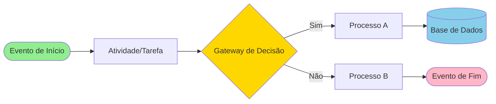

**Elementos:**
- **Círculos**: Eventos (início/fim de processo)
- **Retângulos**: Atividades/Tarefas executadas
- **Losangos**: Gateways de decisão (condicionais)
- **Cilindros**: Operações em banco de dados
- **Setas**: Fluxo de sequência

**Swimlanes (Raias):**
- 👤 **CANDIDATO**: Usuário externo solicitando credenciamento
- 📋 **ANALISTA**: Responsável por análise e validação
- 👔 **GESTOR**: Coordena operações e configurações
- 🔑 **ADMIN**: Administrador do sistema com acesso total
- ⚙️ **SISTEMA**: Processos automatizados e triggers

---

## Fase 1: Criação do Edital

**Objetivo:** Gestor cria novo edital de credenciamento com todas as configurações necessárias.

**Responsável Principal:** Gestor  
**Aprovador:** Admin  
**Tabelas Principais:** `editais`, `workflows`  
**Status Inicial:** `rascunho`

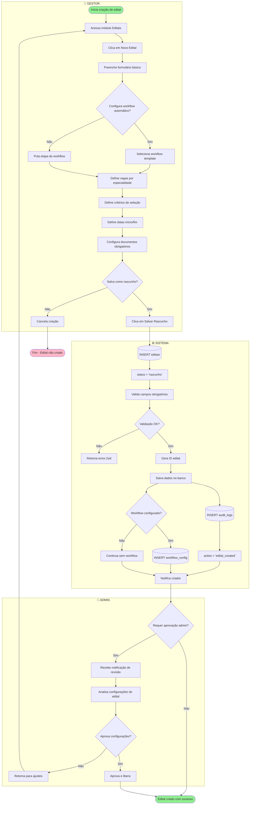

**Campos Obrigatórios (editais):**
- `titulo` (VARCHAR)
- `descricao` (TEXT)
- `tipo_credenciamento` (VARCHAR)
- `data_inicio_inscricoes` (TIMESTAMP)
- `data_fim_inscricoes` (TIMESTAMP)
- `vagas_total` (INTEGER)
- `status` (VARCHAR) - Inicialmente 'rascunho'

**Validações:**
- Data fim > Data início
- Vagas total > 0
- Workflow ID deve existir (se informado)

**Notificações:**
- ✉️ Gestor recebe confirmação de criação
- ✉️ Admin recebe solicitação de aprovação (se configurado)

---

## Fase 2: Publicação do Edital

**Objetivo:** Tornar o edital público e disponível para inscrições de candidatos.

**Responsável Principal:** Gestor  
**Aprovador:** Admin (opcional)  
**Tabelas Principais:** `editais`, `app_notifications`  
**Transição de Status:** `rascunho` → `publicado`

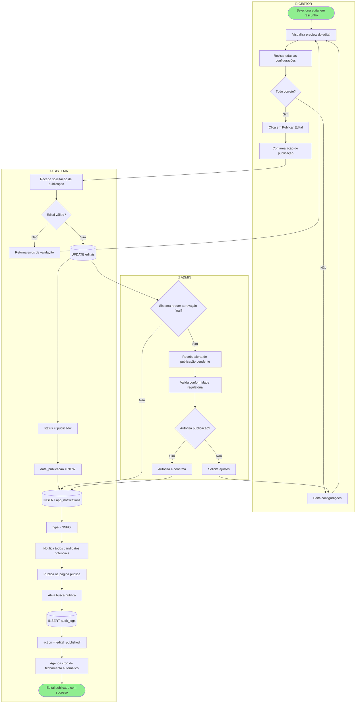

**Operações de Banco:**
```sql
-- Update status do edital
UPDATE editais 
SET status = 'publicado', 
    data_publicacao = NOW(),
    updated_at = NOW()
WHERE id = ?;

-- Cria notificações para candidatos
INSERT INTO app_notifications (user_id, title, message, type)
SELECT id, 'Novo Edital Publicado', 'Edital {titulo} está aberto para inscrições', 'INFO'
FROM profiles WHERE role = 'candidato';

-- Registra auditoria
INSERT INTO audit_logs (action, resource_type, resource_id, user_id)
VALUES ('edital_published', 'editais', ?, ?);
```

**Notificações Enviadas:**
- ✉️ Todos candidatos: Novo edital disponível
- ✉️ Gestores: Confirmação de publicação
- 🔔 Sistema: Alerta agendado para data de fechamento

**Automações Ativadas:**
- ⏰ Cron job para fechar edital automaticamente na `data_fim_inscricoes`
- 📊 Métricas de visualização do edital
- 🔍 Indexação para busca pública

---

## Fase 3: Inscrição do Candidato

**Objetivo:** Candidato realiza inscrição completa com dados e documentos.

**Responsável Principal:** Candidato  
**Tabelas Principais:** `inscricoes_edital`, `inscricao_documentos`, `inscricao_consultorios`, `analises`  
**Status Inicial:** `rascunho` → `em_analise`

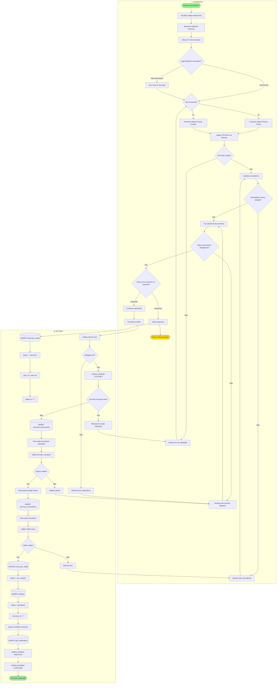

**Validações Frontend (Zod Schema):**

```typescript
// Pessoa Física
{
  nome_completo: z.string().min(3).max(200),
  cpf: z.string().regex(/^\d{11}$/),
  rg: z.string().optional(),
  data_nascimento: z.date(),
  email: z.string().email(),
  telefone: z.string().regex(/^\d{10,11}$/),
  endereco: {
    logradouro: z.string(),
    numero: z.string(),
    bairro: z.string(),
    cidade: z.string(),
    estado: z.string().length(2),
    cep: z.string().regex(/^\d{8}$/)
  }
}

// Consultórios (min 1)
{
  cnes: z.string().length(7),
  nome_consultorio: z.string(),
  endereco_completo: z.object({...}),
  horarios_atendimento: z.array(...)
}

// Documentos obrigatórios
- RG ou CNH (PF)
- Comprovante de residência
- CRM ativo
- Certificado de especialização
- Alvará de funcionamento (consultório)
```

**Operações de Banco:**

```sql
-- Inscrição inicial
INSERT INTO inscricoes_edital (user_id, edital_id, tipo_pessoa, dados_candidato, status)
VALUES (?, ?, 'PF', ?::jsonb, 'rascunho');

-- Documentos
INSERT INTO inscricao_documentos (inscricao_id, tipo_documento, nome_arquivo, storage_path)
VALUES (?, 'rg', 'rg_joao.pdf', 'inscricoes/{id}/rg_joao.pdf');

-- Consultórios
INSERT INTO inscricao_consultorios (inscricao_id, cnes, nome, endereco_completo, horarios)
VALUES (?, '1234567', 'Clínica ABC', ?::jsonb, ?::jsonb);

-- Análise automática
INSERT INTO analises (inscricao_id, status, analista_id)
VALUES (?, 'pendente', NULL);
```

**Notificações:**
- ✉️ Candidato: Confirmação de recebimento de inscrição
- ✉️ Analistas: Nova inscrição disponível para análise
- 📊 Gestor: Métrica de novas inscrições

---

## Fase 4: Análise de Documentos

**Objetivo:** Análise automatizada e manual de documentos e dados da inscrição.

**Responsável Principal:** Analista + Sistema (IA)  
**Tabelas Principais:** `analises`, `correcoes_inscricao`, `inscricoes_edital`  
**Transições:** `em_analise` → `aprovada` | `reprovada` | `pendente_correcao`

```mermaid
flowchart TB
    subgraph SISTEMA["⚙️ SISTEMA - Análise Automática"]
        S1([Trigger: Nova inscrição]) --> S2[Inicia processamento automático]
        S2 --> S3[OCR em documentos PDF]
        S3 --> S4[Extrai texto e dados estruturados]
        S4 --> S5[Validação CPF via API Receita]
        S5 --> S6{CPF válido e ativo?}
        S6 -->|Não| S7[Score -= 30 pontos]
        S6 -->|Sim| S8[Score += 10 pontos]
        S7 --> S9
        S8 --> S9[Validação CRM via CFM API]
        S9 --> S10{CRM ativo e regular?}
        S10 -->|Não| S11[Score -= 40 pontos]
        S10 -->|Sim| S12[Score += 20 pontos]
        S11 --> S13
        S12 --> S13[Validação CNES via CNES API]
        S13 --> S14{CNES válido?}
        S14 -->|Não| S15[Score -= 20 pontos]
        S14 -->|Sim| S16[Score += 15 pontos]
        S15 --> S17
        S16 --> S17[Calcula score final 0-100]
        S17 --> S18{Score >= 80?}
        S18 -->|Sim| S19[documentos_analisados = 'OK']
        S18 -->|Não| S20[documentos_analisados = 'REQUER_REVISAO']
        S19 --> S21
        S20 --> S21[(UPDATE analises)]
        S21 --> S22[Atualiza score e status]
        S22 --> S23{Score >= 80?}
        S23 -->|Sim| S24[status = 'aprovado_automatico']
        S23 -->|Não| S25[status = 'pendente_manual']
        S24 --> S26
        S25 --> S26[(INSERT app_notifications)]
        S26 --> S27[Notifica analistas]
    end
    
    subgraph ANALISTA["📋 ANALISTA"]
        AN1([Recebe notificação]) --> AN2[Acessa fila de análises]
        AN2 --> AN3[Ordena por prioridade/data]
        AN3 --> AN4[Seleciona inscrição para analisar]
        AN4 --> AN5[Visualiza dados extraídos OCR]
        AN5 --> AN6[Revisa documentos um a um]
        AN6 --> AN7{Documentos OK?}
        AN7 -->|Não| AN8[Marca documentos reprovados]
        AN7 -->|Sim| AN9[Verifica dados cadastrais]
        AN8 --> AN9
        AN9 --> AN10{Dados consistentes?}
        AN10 -->|Não| AN11[Marca campos reprovados]
        AN10 -->|Sim| AN12{Qual decisão?}
        AN11 --> AN12
        AN12 -->|Aprovar| AN13[Registra parecer favorável]
        AN12 -->|Solicitar Correção| AN14[Define prazo para correção]
        AN12 -->|Reprovar| AN15[Registra motivo reprovação]
        AN13 --> AN16[Submete decisão]
        AN14 --> AN17[Lista campos/docs a corrigir]
        AN15 --> AN16
        AN17 --> AN16
    end
    
    subgraph CANDIDATO["👤 CANDIDATO"]
        C1([Recebe notificação]) --> C2{Tipo de decisão?}
        C2 -->|Aprovado| C3[Aguarda contrato]
        C2 -->|Pendente Correção| C4[Visualiza campos reprovados]
        C2 -->|Reprovado| C5[Visualiza motivo]
        C4 --> C6[Corrige dados solicitados]
        C6 --> C7[Reenvia documentos]
        C7 --> C8[Adiciona justificativa]
        C8 --> C9[Submete correções]
        C5 --> C10([Processo encerrado])
    end
    
    subgraph GESTOR["👔 GESTOR - Supervisão"]
        G1[Monitora dashboard de análises] --> G2{Gargalos identificados?}
        G2 -->|Sim| G3[Reatribui analistas]
        G2 -->|Não| G4[Supervisiona tempos]
        G3 --> G5[Redistribui carga]
        G4 --> G6{Decisões contestadas?}
        G6 -->|Sim| G7[Reabre análise]
        G6 -->|Não| G8[Aprova decisões]
        G7 --> AN2
    end
    
    AN16 --> S30[(UPDATE analises)]
    S30 --> S31{Status decisão?}
    S31 -->|aprovado| S32[status = 'aprovado']
    S31 -->|pendente_correcao| S33[status = 'pendente_correcao']
    S31 -->|reprovado| S34[status = 'reprovado']
    
    S32 --> S35[(UPDATE inscricoes_edital)]
    S33 --> S36[(INSERT correcoes_inscricao)]
    S34 --> S35
    
    S35 --> S37[Atualiza status correspondente]
    S36 --> S38[Registra campos/docs reprovados]
    
    S37 --> S39[(INSERT app_notifications)]
    S38 --> S39
    S39 --> C1
    
    C9 --> S40[(INSERT correcoes_inscricao)]
    S40 --> S41[versao += 1]
    S41 --> S42[status = 'enviada']
    S42 --> S27
    
    style S1 fill:#90EE90
    style C10 fill:#FFB6C6
    style C3 fill:#90EE90
```

**Edge Functions:**
- `validar-cpf-receita`: Consulta API Receita Federal
- `validar-crm-cfm`: Consulta API do CFM
- `validar-cnes`: Consulta CNES do DataSUS
- `processar-ocr-documentos`: OCR com Tesseract.js ou Google Vision

**Operações de Banco:**

```sql
-- Atualiza análise automática
UPDATE analises 
SET documentos_analisados = jsonb_build_object(
      'cpf_valido', true,
      'crm_regular', true,
      'cnes_ativo', true,
      'score_automatico', 85
    ),
    status = 'pendente_manual'
WHERE inscricao_id = ?;

-- Registra decisão do analista
UPDATE analises
SET status = 'aprovado',
    analista_id = ?,
    analisado_em = NOW(),
    parecer = 'Documentos e dados validados. Aprovado.',
    campos_reprovados = NULL,
    documentos_reprovados = NULL
WHERE id = ?;

-- Solicita correção
UPDATE analises
SET status = 'pendente_correcao',
    analista_id = ?,
    analisado_em = NOW(),
    motivo_reprovacao = 'Documentos ilegíveis',
    campos_reprovados = '["cpf", "endereco.cep"]'::jsonb,
    documentos_reprovados = '["rg", "comprovante_residencia"]'::jsonb,
    prazo_correcao = NOW() + INTERVAL '15 days'
WHERE id = ?;

-- Registra correção do candidato
INSERT INTO correcoes_inscricao (inscricao_id, campos_corrigidos, documentos_reenviados, status)
VALUES (?, ?::jsonb, ARRAY['rg_novo.pdf', 'comprovante_novo.pdf'], 'enviada');
```

**Notificações:**
- ✉️ Candidato: Aprovado / Solicita correção / Reprovado
- ✉️ Analista: Nova inscrição na fila
- 📊 Gestor: Métricas de tempo de análise

**Prazos:**
- ⏰ Análise automática: Imediata (< 2 minutos)
- ⏰ Análise manual: SLA de 5 dias úteis
- ⏰ Prazo para correção do candidato: 15 dias corridos

---

## Fase 5: Geração de Contrato

**Objetivo:** Gerar contrato personalizado automaticamente após aprovação da inscrição.

**Responsável Principal:** Sistema + Gestor  
**Tabelas Principais:** `contratos`, `contract_templates`, `inscricoes_edital`  
**Status Inicial:** `rascunho` → `pendente_assinatura`

```mermaid
flowchart TB
    subgraph SISTEMA["⚙️ SISTEMA - Geração Automática"]
        S1([Trigger: Inscrição aprovada]) --> S2[Edge Function: gerar-contrato]
        S2 --> S3[(SELECT contract_templates)]
        S3 --> S4{Template ativo encontrado?}
        S4 -->|Não| S5[Usa template padrão]
        S4 -->|Sim| S6[Carrega template HTML]
        S5 --> S6
        S6 --> S7[(SELECT inscricoes_edital)]
        S7 --> S8[Carrega dados do candidato]
        S8 --> S9[Extrai variáveis dinâmicas]
        S9 --> S10[{{nome_completo}}, {{cpf}}, {{crm}}, etc]
        S10 --> S11[Substitui placeholders no HTML]
        S11 --> S12[Renderiza HTML completo]
        S12 --> S13[Gera PDF com jsPDF]
        S13 --> S14[Calcula hash SHA-256 do PDF]
        S14 --> S15[Upload para storage: contratos/]
        S15 --> S16[(INSERT contratos)]
        S16 --> S17[status = 'rascunho']
        S17 --> S18[Gera número de contrato único]
        S18 --> S19[CONT-2025-0001234]
        S19 --> S20[(UPDATE inscricoes_edital)]
        S20 --> S21[contrato_id = ?]
        S21 --> S22[(INSERT app_notifications)]
        S22 --> S23[Notifica gestor para revisão]
        S23 --> S24([Contrato gerado])
    end
    
    subgraph GESTOR["👔 GESTOR - Revisão"]
        G1([Recebe notificação]) --> G2[Acessa módulo Contratos]
        G2 --> G3[Filtra contratos em rascunho]
        G3 --> G4[Visualiza contrato gerado]
        G4 --> G5[Faz download do PDF]
        G5 --> G6{Contrato OK?}
        G6 -->|Não| G7{Tipo de ajuste?}
        G6 -->|Sim| G8[Aprova contrato]
        G7 -->|Dados incorretos| G9[Edita dados do contrato]
        G7 -->|Template errado| G10[Seleciona outro template]
        G9 --> G11[Clica em Regerar Contrato]
        G10 --> G11
        G11 --> S2
        G8 --> G12[Confirma envio para assinatura]
    end
    
    subgraph CANDIDATO["👤 CANDIDATO - Notificação"]
        C1([Recebe notificação]) --> C2[Contrato disponível para revisão]
        C2 --> C3[Acessa área de contratos]
        C3 --> C4[Visualiza contrato em PDF]
        C4 --> C5[Aguarda liberação para assinatura]
    end
    
    G12 --> S25[(UPDATE contratos)]
    S25 --> S26[status = 'pendente_assinatura']
    S26 --> S27[aprovado_em = NOW]
    S27 --> S28[aprovado_por = gestor_id]
    S28 --> S29[(INSERT app_notifications)]
    S29 --> S30[Notifica candidato]
    S30 --> C1
    S30 --> S31([Contrato pronto para assinatura])
    
    style S1 fill:#90EE90
    style S24 fill:#FFD700
    style S31 fill:#90EE90
```

**Template de Contrato (contract_templates):**

```html
<!DOCTYPE html>
<html>
<head>
  <title>Contrato de Credenciamento</title>
  <style>
    body { font-family: Arial; font-size: 12pt; }
    .header { text-align: center; font-weight: bold; }
    .clause { margin: 20px 0; text-align: justify; }
  </style>
</head>
<body>
  <div class="header">
    <h1>CONTRATO DE CREDENCIAMENTO N° {{numero_contrato}}</h1>
    <p>Data de emissão: {{data_emissao}}</p>
  </div>
  
  <div class="clause">
    <strong>CONTRATANTE:</strong> {{nome_orgao}}, CNPJ {{cnpj_orgao}}
  </div>
  
  <div class="clause">
    <strong>CONTRATADO:</strong> {{nome_completo}}, CPF {{cpf}}, CRM {{crm}}/{{uf_crm}}
  </div>
  
  <div class="clause">
    <strong>CLÁUSULA PRIMEIRA - DO OBJETO</strong><br>
    O presente contrato tem por objeto o credenciamento do CONTRATADO para prestação de serviços de {{especialidade}} conforme Edital {{edital_numero}}.
  </div>
  
  <!-- ... mais cláusulas ... -->
  
  <div class="signatures">
    <div>_________________________<br>CONTRATANTE</div>
    <div>_________________________<br>CONTRATADO</div>
  </div>
</body>
</html>
```

**Operações de Banco:**

```sql
-- Gera número de contrato sequencial
SELECT 'CONT-' || TO_CHAR(NOW(), 'YYYY') || '-' || LPAD(NEXTVAL('contratos_seq')::TEXT, 7, '0');

-- Insere contrato
INSERT INTO contratos (
  inscricao_id, 
  analise_id, 
  template_id, 
  numero_contrato, 
  status, 
  documento_url, 
  dados_contrato
)
VALUES (
  ?, 
  ?, 
  ?, 
  'CONT-2025-0001234', 
  'rascunho', 
  'contratos/2025/CONT-2025-0001234.pdf',
  jsonb_build_object(
    'hash_documento', 'sha256...',
    'gerado_em', NOW(),
    'variaveis', jsonb_build_object(
      'nome_completo', 'João da Silva',
      'cpf', '12345678900',
      'crm', '123456',
      'uf_crm', 'SP'
    )
  )
);

-- Aprova contrato para assinatura
UPDATE contratos
SET status = 'pendente_assinatura',
    aprovado_em = NOW(),
    aprovado_por = ?
WHERE id = ?;
```

**Edge Function: `gerar-contrato`**

```typescript
import { serve } from "https://deno.land/std@0.168.0/http/server.ts"
import { createClient } from 'https://esm.sh/@supabase/supabase-js@2'
import { jsPDF } from 'https://cdn.skypack.dev/jspdf'

serve(async (req) => {
  const { inscricao_id } = await req.json()
  
  // 1. Busca template ativo
  const { data: template } = await supabase
    .from('contract_templates')
    .select('conteudo_html, campos_mapeados')
    .eq('is_active', true)
    .single()
  
  // 2. Busca dados do candidato
  const { data: inscricao } = await supabase
    .from('inscricoes_edital')
    .select('*, analises(*)')
    .eq('id', inscricao_id)
    .single()
  
  // 3. Substitui variáveis
  let html = template.conteudo_html
  for (const [key, value] of Object.entries(inscricao.dados_candidato)) {
    html = html.replace(new RegExp(`{{${key}}}`, 'g'), value)
  }
  
  // 4. Gera PDF
  const doc = new jsPDF()
  doc.html(html, {
    callback: function (doc) {
      const pdfBlob = doc.output('blob')
      // Upload para Supabase Storage
      // ...
    }
  })
  
  // 5. Insere registro de contrato
  const { data: contrato } = await supabase
    .from('contratos')
    .insert({ inscricao_id, status: 'rascunho', ... })
    .select()
    .single()
  
  return new Response(JSON.stringify({ contrato }), { status: 200 })
})
```

**Notificações:**
- ✉️ Gestor: Novo contrato gerado para revisão
- ✉️ Candidato: Contrato em preparação (após aprovação do gestor)

---

## Fase 6: Assinatura do Contrato

**Objetivo:** Candidato assina digitalmente o contrato de credenciamento.

**Responsável Principal:** Candidato  
**Tabelas Principais:** `contratos`, `signature_requests`  
**Transição:** `pendente_assinatura` → `assinado` | `expirado`

```mermaid
flowchart TB
    subgraph CANDIDATO["👤 CANDIDATO"]
        C1([Recebe notificação]) --> C2[Acessa área Meus Contratos]
        C2 --> C3[Visualiza contrato pendente]
        C3 --> C4[Clica em Visualizar Contrato]
        C4 --> C5[Lê todas as cláusulas]
        C5 --> C6{Tem dúvidas?}
        C6 -->|Sim| C7[Solicita esclarecimento]
        C6 -->|Não| C8{Aceita os termos?}
        C7 --> C9[Aguarda resposta]
        C8 -->|Não| C10[Recusa assinatura]
        C8 -->|Sim| C11[Clica em Assinar Digitalmente]
        C9 --> C5
        C10 --> C12([Processo cancelado])
        C11 --> C13[Confirma identidade]
        C13 --> C14[Sistema gera token de assinatura]
        C14 --> C15[Insere código enviado por e-mail]
        C15 --> C16{Código válido?}
        C16 -->|Não| C17[Mostra erro]
        C16 -->|Sim| C18[Registra assinatura digital]
        C17 --> C15
        C18 --> C19[Upload documentos complementares]
        C19 --> C20{Documentos anexados?}
        C20 -->|Sim| C21[Valida arquivos]
        C20 -->|Não| C22[Pula etapa]
        C21 --> C23[Finaliza assinatura]
        C22 --> C23
    end
    
    subgraph SISTEMA["⚙️ SISTEMA"]
        S1[Recebe solicitação de assinatura] --> S2{Contrato ainda válido?}
        S2 -->|Não| S3[Verifica prazo de assinatura]
        S2 -->|Sim| S4[Gera token único]
        S3 --> S5{Prazo expirado?}
        S5 -->|Sim| S6[(UPDATE contratos)]
        S5 -->|Não| S4
        S6 --> S7[status = 'expirado']
        S7 --> S8[Notifica candidato e gestor]
        S4 --> S9[Cria hash: SHA256(user_id + contrato_id + timestamp)]
        S9 --> S10[Envia token por e-mail]
        S10 --> S11[(INSERT signature_requests)]
        S11 --> S12[Aguarda confirmação do candidato]
        
        S13[Recebe confirmação de assinatura] --> S14[Valida token]
        S14 --> S15{Token válido e não expirado?}
        S15 -->|Não| S16[Rejeita assinatura]
        S15 -->|Sim| S17[Marca token como usado]
        S17 --> S18[(UPDATE contratos)]
        S18 --> S19[status = 'assinado']
        S19 --> S20[assinado_em = NOW]
        S20 --> S21[Anexa documentos complementares]
        S21 --> S22[Calcula novo hash do contrato]
        S22 --> S23[Armazena versão assinada]
        S23 --> S24[(INSERT audit_logs)]
        S24 --> S25[action = 'contrato_assinado']
        S25 --> S26[(INSERT app_notifications)]
        S26 --> S27[Notifica gestor]
        S27 --> S28[Dispara workflow de credenciamento]
        S28 --> S29([Assinatura concluída])
    end
    
    subgraph GESTOR["👔 GESTOR - Monitoramento"]
        G1[Monitora contratos pendentes] --> G2{Contratos próximos de expirar?}
        G2 -->|Sim| G3[Visualiza lista]
        G2 -->|Não| G4[Aguarda]
        G3 --> G5{Prorrogar prazo?}
        G5 -->|Sim| G6[Estende prazo em X dias]
        G5 -->|Não| G7{Cancelar contrato?}
        G6 --> G8[Notifica candidato]
        G7 -->|Sim| G9[Cancela contrato]
        G7 -->|Não| G4
        G9 --> G10[Libera vaga do edital]
    end
    
    C23 --> S13
    
    G6 --> S30[(UPDATE contratos)]
    S30 --> S31[prazo_assinatura = prazo_atual + X dias]
    S31 --> G8
    
    G9 --> S32[(UPDATE contratos)]
    S32 --> S33[status = 'cancelado']
    S33 --> S34[motivo_cancelamento = 'Não assinado no prazo']
    
    style C1 fill:#90EE90
    style C12 fill:#FFB6C6
    style S8 fill:#FFB6C6
    style S29 fill:#90EE90
```

**Operações de Banco:**

```sql
-- Gera requisição de assinatura
INSERT INTO signature_requests (
  contrato_id,
  signatario_user_id,
  token_assinatura,
  valido_ate,
  status
)
VALUES (
  ?,
  ?,
  encode(digest(concat(?, ?, now()::text), 'sha256'), 'hex'),
  NOW() + INTERVAL '30 days',
  'pendente'
);

-- Registra assinatura
UPDATE contratos
SET status = 'assinado',
    assinado_em = NOW(),
    dados_contrato = jsonb_set(
      dados_contrato,
      '{assinatura}',
      jsonb_build_object(
        'assinado_por', ?,
        'assinado_em', NOW(),
        'ip_origem', ?,
        'user_agent', ?,
        'token_usado', ?
      )
    )
WHERE id = ?;

UPDATE signature_requests
SET status = 'assinado',
    assinado_em = NOW()
WHERE token_assinatura = ?;

-- Contrato expirado (executado por cron)
UPDATE contratos
SET status = 'expirado',
    updated_at = NOW()
WHERE status = 'pendente_assinatura'
  AND created_at < NOW() - INTERVAL '30 days';
```

**Validações de Segurança:**
- ✅ Token de assinatura único e válido por 24h
- ✅ Verificação de identidade (código enviado por e-mail)
- ✅ Registro de IP e User Agent
- ✅ Hash SHA-256 do documento assinado
- ✅ Impossível assinar após expiração do prazo

**Notificações:**
- ✉️ Candidato: Token de assinatura + instruções
- ✉️ Candidato: Confirmação de assinatura bem-sucedida
- ✉️ Gestor: Novo contrato assinado
- ⏰ Candidato: Lembretes antes do prazo expirar (7, 3, 1 dias)

**Prazos:**
- ⏰ Prazo padrão para assinatura: 30 dias corridos
- ⏰ Token de assinatura: Válido por 24 horas
- ⏰ Lembrete automático: 7, 3 e 1 dia antes do vencimento

---

## Fase 7: Credenciamento

**Objetivo:** Criar registro de credenciado ativo com todos os dados necessários para operação.

**Responsável Principal:** Sistema + Gestor  
**Tabelas Principais:** `credenciados`, `credenciado_crms`, `credenciado_consultorios`, `certificados`, `prazos_credenciamento`  
**Status Inicial:** `Ativo`

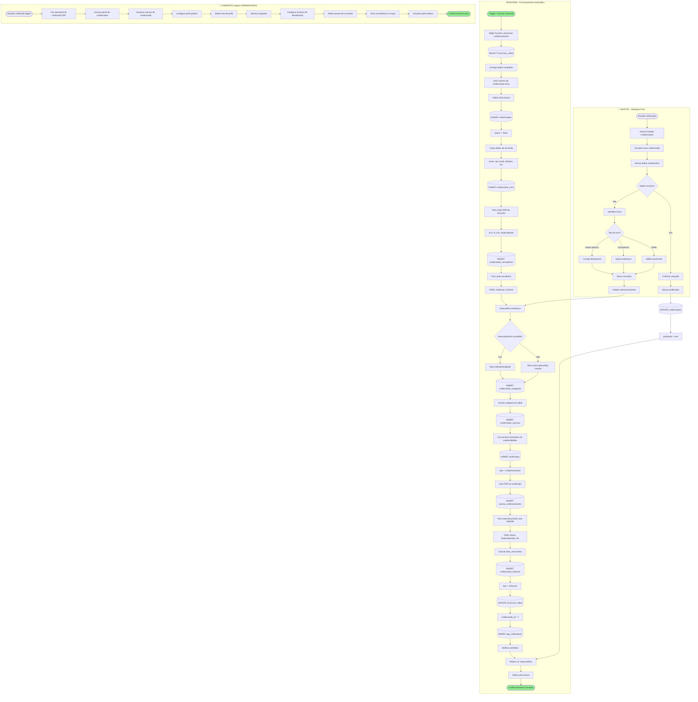

**Operações de Banco:**

```sql
-- Gera número sequencial de credenciado
SELECT 'CRED-' || TO_CHAR(NOW(), 'YYYY') || '-' || LPAD(NEXTVAL('credenciados_seq')::TEXT, 5, '0');

-- Cria credenciado
INSERT INTO credenciados (
  inscricao_id,
  numero_credenciado,
  nome,
  cpf,
  email,
  telefone,
  status,
  data_habilitacao
)
SELECT 
  id,
  'CRED-2025-00123',
  dados_candidato->>'nome_completo',
  dados_candidato->>'cpf',
  dados_candidato->>'email',
  dados_candidato->>'telefone',
  'Ativo',
  NOW()
FROM inscricoes_edital
WHERE id = ?;

-- Cria CRMs do credenciado
INSERT INTO credenciado_crms (credenciado_id, crm, uf_crm, especialidade, especialidade_id)
SELECT 
  ?,
  crm_data->>'numero',
  crm_data->>'uf',
  crm_data->>'especialidade',
  (SELECT id FROM especialidades_medicas WHERE nome = crm_data->>'especialidade')
FROM inscricoes_edital,
     jsonb_array_elements(dados_candidato->'crms') AS crm_data
WHERE id = ?;

-- Cria consultórios
INSERT INTO credenciado_consultorios (
  credenciado_id,
  inscricao_consultorio_id,
  cnes,
  nome_consultorio,
  logradouro,
  numero,
  bairro,
  cidade,
  estado,
  cep,
  horarios,
  is_principal
)
SELECT 
  ?,
  ic.id,
  ic.cnes,
  ic.nome_consultorio,
  ic.endereco_completo->>'logradouro',
  ic.endereco_completo->>'numero',
  ic.endereco_completo->>'bairro',
  ic.endereco_completo->>'cidade',
  ic.endereco_completo->>'estado',
  ic.endereco_completo->>'cep',
  ic.horarios,
  ic.is_principal
FROM inscricao_consultorios ic
WHERE ic.inscricao_id = ?;

-- Geocodifica endereços (via Edge Function ou API externa)
UPDATE credenciado_consultorios
SET latitude = ?,
    longitude = ?,
    geocoded_at = NOW()
WHERE id = ?;

-- Gera certificado digital
INSERT INTO certificados (
  credenciado_id,
  tipo,
  numero_certificado,
  status,
  emitido_em,
  valido_ate
)
VALUES (
  ?,
  'credenciamento',
  'CERT-' || TO_CHAR(NOW(), 'YYYY') || '-' || LPAD(NEXTVAL('certificados_seq')::TEXT, 6, '0'),
  'ativo',
  NOW(),
  NOW() + INTERVAL '1 year'
);

-- Cria prazos de documentos
INSERT INTO prazos_credenciamento (
  credenciado_id,
  tipo_prazo,
  data_vencimento,
  status,
  notificar_em
)
VALUES 
  (?, 'renovacao_crm', '2026-12-31', 'ativo', '2026-10-31'),
  (?, 'alvara_sanitario', '2025-12-31', 'ativo', '2025-10-31'),
  (?, 'certificado_especializacao', '2027-06-30', 'ativo', '2027-04-30');
```

**Edge Function: `processar-credenciamento`**

```typescript
import { serve } from "https://deno.land/std@0.168.0/http/server.ts"
import { createClient } from '@supabase/supabase-js'

serve(async (req) => {
  const { inscricao_id } = await req.json()
  
  // 1. Busca dados da inscrição
  const { data: inscricao } = await supabase
    .from('inscricoes_edital')
    .select('*, inscricao_consultorios(*), inscricao_documentos(*)')
    .eq('id', inscricao_id)
    .single()
  
  // 2. Gera número de credenciado
  const numero = await gerarNumeroCredenciado()
  
  // 3. Cria credenciado
  const { data: credenciado } = await supabase
    .from('credenciados')
    .insert({
      inscricao_id,
      numero_credenciado: numero,
      nome: inscricao.dados_candidato.nome_completo,
      cpf: inscricao.dados_candidato.cpf,
      status: 'Ativo',
      ...
    })
    .select()
    .single()
  
  // 4. Cria CRMs
  for (const crm of inscricao.dados_candidato.crms) {
    await supabase.from('credenciado_crms').insert({
      credenciado_id: credenciado.id,
      crm: crm.numero,
      uf_crm: crm.uf,
      especialidade: crm.especialidade
    })
  }
  
  // 5. Geocodifica e cria consultórios
  for (const consultorio of inscricao.inscricao_consultorios) {
    const { lat, lng } = await geocodificar(consultorio.endereco_completo)
    
    await supabase.from('credenciado_consultorios').insert({
      credenciado_id: credenciado.id,
      cnes: consultorio.cnes,
      latitude: lat,
      longitude: lng,
      ...
    })
  }
  
  // 6. Gera certificado
  const certificadoPDF = await gerarCertificado(credenciado)
  const { data: cert } = await supabase.from('certificados').insert({
    credenciado_id: credenciado.id,
    tipo: 'credenciamento',
    documento_url: certificadoPDF.url
  })
  
  // 7. Cria prazos
  await criarPrazos(credenciado.id, inscricao.inscricao_documentos)
  
  // 8. Notifica
  await notificar(credenciado.user_id, 'Credenciamento concluído!')
  
  return new Response(JSON.stringify({ credenciado }), { status: 200 })
})
```

**Geocodificação (Google Maps API ou Nominatim):**

```typescript
async function geocodificar(endereco: any) {
  const address = `${endereco.logradouro}, ${endereco.numero}, ${endereco.cidade}, ${endereco.estado}, ${endereco.cep}`
  
  const response = await fetch(
    `https://maps.googleapis.com/maps/api/geocode/json?address=${encodeURIComponent(address)}&key=${API_KEY}`
  )
  
  const data = await response.json()
  
  if (data.results.length > 0) {
    return {
      lat: data.results[0].geometry.location.lat,
      lng: data.results[0].geometry.location.lng
    }
  }
  
  return { lat: null, lng: null }
}
```

**Notificações:**
- ✉️ Candidato: Certificado digital de credenciamento
- ✉️ Candidato: Instruções de acesso ao painel
- ✉️ Gestor: Novo credenciado ativo
- 📊 Dashboard: Atualização de métricas

**Dados Publicados no Mapa:**
- 📍 Localização dos consultórios
- 👨‍⚕️ Nome do profissional
- 🏥 Especialidades
- ⏰ Horários de atendimento
- ⭐ Avaliações (inicialmente zeradas)

---

## Fase 8: Operação Pós-Credenciamento

**Objetivo:** Gestão contínua do credenciado ativo, incluindo prazos, avaliações, sanções e afastamentos.

**Responsável Principal:** Sistema (Cron) + Gestor + Credenciado  
**Tabelas Principais:** `prazos_credenciamento`, `avaliacoes_prestadores`, `avaliacoes_publicas`, `ocorrencias_prestadores`, `sancoes_prestadores`, `afastamentos_credenciados`  
**Status Possíveis:** `Ativo`, `Suspenso`, `Em Afastamento`, `Descredenciado`

```mermaid
flowchart TB
    subgraph SISTEMA["⚙️ SISTEMA - Automações Diárias"]
        S1([Cron diário: 00:00]) --> S2[Edge Function: atualizar-prazos-diario]
        S2 --> S3[(SELECT prazos_credenciamento)]
        S3 --> S4[WHERE status = 'ativo']
        S4 --> S5[Calcula dias_para_vencer]
        S5 --> S6{Prazo em qual faixa?}
        S6 -->|> 60 dias| S7[Nenhuma ação]
        S6 -->|30-60 dias| S8[Alerta INFORMATIVO]
        S6 -->|15-29 dias| S9[Alerta URGENTE]
        S6 -->|1-14 dias| S10[Alerta CRÍTICO]
        S6 -->|<= 0 dias| S11[Prazo VENCIDO]
        
        S8 --> S12[(INSERT alertas_enviados)]
        S9 --> S12
        S10 --> S12
        S12 --> S13[Envia e-mail ao credenciado]
        S13 --> S14[(INSERT app_notifications)]
        
        S11 --> S15[(UPDATE prazos_credenciamento)]
        S15 --> S16[status = 'vencido']
        S16 --> S17[Edge Function: verificar-suspensoes]
        S17 --> S18[(SELECT regras_suspensao)]
        S18 --> S19{Regra aplicável?}
        S19 -->|Sim| S20[(UPDATE credenciados)]
        S19 -->|Não| S21[Continua]
        S20 --> S22[status = 'Suspenso']
        S22 --> S23[suspensao_automatica = true]
        S23 --> S24[motivo_suspensao = 'Documento X vencido']
        S24 --> S25[(INSERT sancoes_prestadores)]
        S25 --> S26[tipo = 'suspensao_automatica']
        S26 --> S27[Notifica credenciado e gestor]
        
        S30[Cron: Moderar avaliações] --> S31[(SELECT avaliacoes_publicas)]
        S31 --> S32[WHERE status = 'pendente']
        S32 --> S33[Edge Function: moderar-avaliacoes]
        S33 --> S34[Análise IA - OpenAI Moderation]
        S34 --> S35{Conteúdo impróprio?}
        S35 -->|Sim| S36[status = 'rejeitada']
        S35 -->|Não| S37{Score >= 0.8?}
        S37 -->|Sim| S38[status = 'aprovada']
        S37 -->|Não| S39[status = 'pendente_manual']
        S36 --> S40[(UPDATE avaliacoes_publicas)]
        S38 --> S40
        S39 --> S40
    end
    
    subgraph CREDENCIADO["👤 CREDENCIADO"]
        CR1([Recebe alerta de vencimento]) --> CR2{Ação do credenciado?}
        CR2 -->|Renovar documento| CR3[Acessa módulo Documentos]
        CR2 -->|Ignorar| CR4[Documento vence]
        CR3 --> CR5[Faz upload de novo documento]
        CR5 --> CR6[Define nova data de validade]
        CR6 --> CR7[Submete renovação]
        
        CR10([Recebe avaliação pública]) --> CR11[Visualiza comentário]
        CR11 --> CR12{Deseja responder?}
        CR12 -->|Sim| CR13[Escreve resposta profissional]
        CR12 -->|Não| CR14[Ignora]
        CR13 --> CR15[Submete resposta]
        
        CR20([Solicita afastamento]) --> CR21[Acessa módulo Afastamentos]
        CR21 --> CR22{Tipo de afastamento?}
        CR22 -->|Temporário| CR23[Define período de ausência]
        CR22 -->|Definitivo| CR24[Solicita descredenciamento]
        CR23 --> CR25[Anexa documentos comprobatórios]
        CR24 --> CR25
        CR25 --> CR26[Justifica motivo]
        CR26 --> CR27[Submete solicitação]
    end
    
    subgraph GESTOR["👔 GESTOR"]
        G1([Monitora dashboard]) --> G2[Visualiza credenciados]
        G2 --> G3{Filtro aplicado?}
        G3 -->|Ativos| G4[Lista credenciados ativos]
        G3 -->|Suspensos| G5[Lista suspensos]
        G3 -->|Prazos críticos| G6[Lista prazos vencendo]
        
        G10[Cria avaliação interna] --> G11[Seleciona credenciado]
        G11 --> G12[Preenche critérios de avaliação]
        G12 --> G13[Pontua cada critério 1-5]
        G13 --> G14[Adiciona observações]
        G14 --> G15[Finaliza avaliação]
        
        G20[Registra ocorrência] --> G21{Tipo de ocorrência?}
        G21 -->|Leve| G22[Registra advertência]
        G21 -->|Grave| G23[Aplica suspensão]
        G21 -->|Gravíssima| G24[Inicia descredenciamento]
        G22 --> G25[Define prazo de correção]
        G23 --> G26[Define período de suspensão]
        G24 --> G27[Justifica descredenciamento]
        
        G30[Analisa afastamento] --> G31{Documentação OK?}
        G31 -->|Sim| G32[Aprova afastamento]
        G31 -->|Não| G33[Solicita complementação]
        G32 --> G34[(UPDATE afastamentos_credenciados)]
        G34 --> G35[status = 'aprovado']
        G35 --> G36[(UPDATE credenciados)]
        G36 --> G37[status = 'Em Afastamento']
    end
    
    subgraph PUBLICO["🌐 PÚBLICO"]
        P1([Busca no mapa]) --> P2[Encontra credenciado]
        P2 --> P3[Visualiza perfil]
        P3 --> P4{Foi atendido?}
        P4 -->|Sim| P5[Clica em Avaliar]
        P4 -->|Não| P6[Apenas visualiza]
        P5 --> P7[Dá nota 1-5 estrelas]
        P7 --> P8[Escreve comentário]
        P8 --> P9[Anexa comprovante opcional]
        P9 --> P10[Submete avaliação]
        
        P20([Consulta certificado]) --> P21{Tipo de consulta?}
        P21 -->|Por código| P22[Insere código do certificado]
        P21 -->|Por CPF| P23[Insere CPF do credenciado]
        P22 --> P24[Sistema valida]
        P23 --> P24
        P24 --> P25{Certificado válido?}
        P25 -->|Sim| P26[Exibe dados do certificado]
        P25 -->|Não| P27[Mostra mensagem de erro]
    end
    
    CR7 --> S50[(UPDATE prazos_credenciamento)]
    S50 --> S51[data_vencimento = nova_data]
    S51 --> S52[status = 'ativo']
    S52 --> S53[renovado = true]
    
    CR15 --> S54[(UPDATE avaliacoes_publicas)]
    S54 --> S55[resposta_profissional = texto]
    S55 --> S56[respondido_em = NOW]
    
    CR27 --> S57[(INSERT afastamentos_credenciados)]
    S57 --> S58[status = 'pendente']
    S58 --> S59[Notifica gestores]
    
    G15 --> S60[(INSERT avaliacoes_prestadores)]
    S60 --> S61[status = 'finalizada']
    S61 --> S62[Calcula pontuacao_geral]
    
    G25 --> S63[(INSERT ocorrencias_prestadores)]
    S63 --> S64[gravidade = 'leve']
    
    G26 --> S65[(INSERT sancoes_prestadores)]
    S65 --> S66[tipo = 'suspensao_temporaria']
    S66 --> S67[(UPDATE credenciados)]
    S67 --> S68[status = 'Suspenso']
    
    G27 --> S69[(INSERT sancoes_prestadores)]
    S69 --> S70[tipo = 'descredenciamento']
    S70 --> S71[(UPDATE credenciados)]
    S71 --> S72[status = 'Descredenciado']
    
    P10 --> S73[(INSERT avaliacoes_publicas)]
    S73 --> S74[status = 'pendente']
    S74 --> S34
    
    style S1 fill:#90EE90
    style P1 fill:#90EE90
```

**Regras de Suspensão Automática:**

```sql
-- Verifica documentos críticos vencidos
SELECT c.id, c.nome
FROM credenciados c
WHERE status = 'Ativo'
  AND EXISTS (
    SELECT 1 
    FROM prazos_credenciamento pc
    WHERE pc.credenciado_id = c.id
      AND pc.tipo_prazo IN ('crm_vencido', 'alvara_sanitario', 'certificado_especializacao')
      AND pc.status = 'vencido'
      AND pc.data_vencimento < NOW() - INTERVAL '30 days'
  );

-- Verifica múltiplas ocorrências graves
SELECT c.id, COUNT(o.id) as total_ocorrencias
FROM credenciados c
JOIN ocorrencias_prestadores o ON o.credenciado_id = c.id
WHERE c.status = 'Ativo'
  AND o.gravidade IN ('grave', 'gravissima')
  AND o.created_at > NOW() - INTERVAL '6 months'
GROUP BY c.id
HAVING COUNT(o.id) >= 3;

-- Aplica suspensão
UPDATE credenciados
SET status = 'Suspenso',
    suspensao_automatica = true,
    suspensao_inicio = NOW(),
    suspensao_fim = CASE 
      WHEN motivo = 'documento_critico' THEN NULL  -- Indefinida até renovação
      WHEN motivo = 'ocorrencias_multiplas' THEN NOW() + INTERVAL '90 days'
    END,
    motivo_suspensao = ?
WHERE id IN (?);
```

**Edge Functions:**

1. **`atualizar-prazos-diario`**: Verifica vencimentos e envia alertas
2. **`verificar-suspensoes`**: Aplica regras de suspensão automática
3. **`moderar-avaliacoes`**: Usa IA para detectar conteúdo impróprio

**Notificações:**
- ✉️ Credenciado: Alertas de vencimento (30, 15, 7, 3, 1 dia antes)
- ✉️ Credenciado: Notificação de suspensão
- ✉️ Gestor: Dashboard de prazos críticos
- ✉️ Gestor: Ocorrências graves registradas
- 📊 Público: Nova avaliação aprovada

---

## Fase 9: Conclusão/Encerramento do Edital

**Objetivo:** Encerrar edital após data limite ou por decisão administrativa.

**Responsável Principal:** Sistema (Cron) + Gestor + Admin  
**Tabelas Principais:** `editais`, `inscricoes_edital`, `audit_logs`  
**Transição:** `publicado` → `encerrado` → `arquivado`

```mermaid
flowchart TB
    subgraph SISTEMA["⚙️ SISTEMA - Encerramento Automático"]
        S1([Cron diário: Verifica editais]) --> S2[(SELECT editais)]
        S2 --> S3[WHERE status = 'publicado']
        S3 --> S4[AND data_fim_inscricoes < NOW]
        S4 --> S5{Editais encontrados?}
        S5 -->|Não| S6[Nenhuma ação]
        S5 -->|Sim| S7[Para cada edital]
        S7 --> S8[(UPDATE editais)]
        S8 --> S9[status = 'encerrado']
        S9 --> S10[encerrado_em = NOW]
        S10 --> S11[Bloqueia novas inscrições]
        S11 --> S12[Gera relatório final]
        S12 --> S13[Calcula estatísticas]
        S13 --> S14{Estatísticas geradas?}
        S14 -->|Sim| S15[total_inscricoes, aprovadas, reprovadas]
        S14 -->|Não| S16[Usa valores padrão]
        S15 --> S17
        S16 --> S17[(INSERT audit_logs)]
        S17 --> S18[action = 'edital_encerrado']
        S18 --> S19[metadata = estatísticas]
        S19 --> S20[(INSERT app_notifications)]
        S20 --> S21[Notifica gestores]
        S21 --> S22[Notifica candidatos pendentes]
        S22 --> S23[Arquiva documentos no storage]
        S23 --> S24([Edital encerrado])
    end
    
    subgraph GESTOR["👔 GESTOR - Encerramento Manual"]
        G1([Acessa módulo Editais]) --> G2[Visualiza editais ativos]
        G2 --> G3[Seleciona edital para encerrar]
        G3 --> G4{Motivo do encerramento?}
        G4 -->|Data limite atingida| G5[Encerramento normal]
        G4 -->|Vagas preenchidas| G6[Encerramento antecipado]
        G4 -->|Decisão administrativa| G7[Cancelamento]
        G6 --> G8[Confirma encerramento]
        G7 --> G9[Justifica cancelamento]
        G5 --> G10
        G8 --> G10[Clica em Encerrar Edital]
        G9 --> G11[Clica em Cancelar Edital]
        
        G20[Visualiza relatório final] --> G21[Acessa dashboard do edital]
        G21 --> G22[Visualiza métricas]
        G22 --> G23[Total de inscrições]
        G23 --> G24[Aprovados / Reprovados / Pendentes]
        G24 --> G25[Credenciados gerados]
        G25 --> G26[Tempo médio de análise]
        G26 --> G27{Exportar dados?}
        G27 -->|Sim| G28[Seleciona formato]
        G27 -->|Não| G29[Fecha relatório]
        G28 --> G30{Formato?}
        G30 -->|Excel| G31[Gera XLSX]
        G30 -->|PDF| G32[Gera PDF]
        G30 -->|CSV| G33[Gera CSV]
        G31 --> G34[Download arquivo]
        G32 --> G34
        G33 --> G34
    end
    
    subgraph ADMIN["🔑 ADMIN - Aprovação e Arquivamento"]
        A1{Encerramento requer aprovação?}
        A2[Recebe solicitação] --> A3{Tipo de encerramento?}
        A3 -->|Normal| A4[Aprova automaticamente]
        A3 -->|Antecipado| A5[Analisa justificativa]
        A3 -->|Cancelamento| A6[Analisa impacto]
        A5 --> A7{Justificativa válida?}
        A6 --> A8{Aprovação autorizada?}
        A7 -->|Sim| A9[Aprova encerramento]
        A7 -->|Não| A10[Rejeita e solicita revisão]
        A8 -->|Sim| A11[Aprova cancelamento]
        A8 -->|Não| A12[Rejeita cancelamento]
        
        A20[Arquiva edital permanentemente] --> A21[Verifica retenção de dados]
        A21 --> A22{Período de retenção?}
        A22 -->|5 anos| A23[Mantém todos os dados]
        A22 -->|1 ano| A24[Remove documentos sensíveis]
        A23 --> A25[(UPDATE editais)]
        A24 --> A25
        A25 --> A26[status = 'arquivado']
        A26 --> A27[arquivado_em = NOW]
        A27 --> A28[Move documentos para cold storage]
        A28 --> A29[Remove acesso público]
    end
    
    subgraph CANDIDATO["👤 CANDIDATO"]
        C1([Recebe notificação de encerramento]) --> C2{Status da inscrição?}
        C2 -->|Aprovado| C3[Já é credenciado]
        C2 -->|Reprovado| C4[Visualiza motivo final]
        C2 -->|Pendente| C5[Inscrição não processada]
        C5 --> C6[Visualiza status final]
        C6 --> C7[Faz download de comprovantes]
        C7 --> C8{Deseja contestar?}
        C8 -->|Sim| C9[Abre recurso]
        C8 -->|Não| C10([Processo finalizado])
        C9 --> C11[Envia recurso ao gestor]
    end
    
    G10 --> A1
    G11 --> A1
    A1 -->|Sim| A2
    A1 -->|Não| S8
    
    A4 --> S8
    A9 --> S8
    A11 --> S35[(UPDATE editais)]
    S35 --> S36[status = 'cancelado']
    S36 --> S37[motivo_cancelamento = ?]
    
    A10 --> G3
    A12 --> G3
    
    S12 --> S40[Edge Function: gerar-relatorio-edital]
    S40 --> S41[(SELECT COUNT(*) FROM inscricoes_edital)]
    S41 --> S42[(SELECT COUNT(*) FROM analises WHERE status = 'aprovado')]
    S42 --> S43[(SELECT COUNT(*) FROM credenciados WHERE inscricao_id IN (...))]
    S43 --> S44[Calcula tempo_medio_analise]
    S44 --> S45[Gera documento PDF]
    S45 --> S46[Salva em storage: relatorios/edital_X.pdf]
    
    C11 --> S50[(INSERT recursos_inscricao)]
    S50 --> S51[status = 'pendente']
    S51 --> S52[Notifica gestor]
    
    style S1 fill:#90EE90
    style S24 fill:#90EE90
    style C10 fill:#FFB6C6
```

**Operações de Banco:**

```sql
-- Encerra edital automaticamente
UPDATE editais
SET status = 'encerrado',
    encerrado_em = NOW(),
    updated_at = NOW()
WHERE status = 'publicado'
  AND data_fim_inscricoes < NOW();

-- Gera estatísticas finais
WITH stats AS (
  SELECT 
    e.id,
    COUNT(DISTINCT i.id) as total_inscricoes,
    COUNT(DISTINCT CASE WHEN a.status = 'aprovado' THEN i.id END) as aprovadas,
    COUNT(DISTINCT CASE WHEN a.status = 'reprovado' THEN i.id END) as reprovadas,
    COUNT(DISTINCT CASE WHEN a.status IN ('pendente', 'pendente_manual') THEN i.id END) as pendentes,
    COUNT(DISTINCT c.id) as credenciados_gerados,
    AVG(EXTRACT(EPOCH FROM (a.analisado_em - i.created_at)) / 86400)::INTEGER as tempo_medio_dias
  FROM editais e
  LEFT JOIN inscricoes_edital i ON i.edital_id = e.id
  LEFT JOIN analises a ON a.inscricao_id = i.id
  LEFT JOIN credenciados c ON c.inscricao_id = i.id
  WHERE e.id = ?
  GROUP BY e.id
)
UPDATE editais
SET dados_encerramento = jsonb_build_object(
  'total_inscricoes', stats.total_inscricoes,
  'aprovadas', stats.aprovadas,
  'reprovadas', stats.reprovadas,
  'pendentes', stats.pendentes,
  'credenciados_gerados', stats.credenciados_gerados,
  'tempo_medio_analise_dias', stats.tempo_medio_dias,
  'encerrado_em', NOW()
)
FROM stats
WHERE editais.id = stats.id;

-- Bloqueia novas inscrições (via RLS)
CREATE POLICY "Bloqueia inscrições em editais encerrados"
ON inscricoes_edital
FOR INSERT
TO authenticated
USING (
  EXISTS (
    SELECT 1 FROM editais
    WHERE id = edital_id
      AND status = 'publicado'
      AND data_fim_inscricoes > NOW()
  )
);

-- Arquiva edital (após período de retenção)
UPDATE editais
SET status = 'arquivado',
    arquivado_em = NOW()
WHERE status = 'encerrado'
  AND encerrado_em < NOW() - INTERVAL '1 year';

-- Remove documentos sensíveis (LGPD)
UPDATE inscricao_documentos
SET storage_path = NULL,
    documento_url = NULL,
    metadata = jsonb_set(
      COALESCE(metadata, '{}'::jsonb),
      '{removido_em}',
      to_jsonb(NOW())
    )
WHERE inscricao_id IN (
  SELECT id FROM inscricoes_edital
  WHERE edital_id IN (
    SELECT id FROM editais
    WHERE status = 'arquivado'
  )
);
```

**Relatório Final Gerado:**

```typescript
interface RelatorioEdital {
  edital: {
    id: string
    titulo: string
    numero: string
    periodo: { inicio: Date, fim: Date }
  }
  estatisticas: {
    total_inscricoes: number
    aprovadas: number
    reprovadas: number
    pendentes: number
    taxa_aprovacao: number  // %
    credenciados_gerados: number
    tempo_medio_analise_dias: number
  }
  distribuicao_por_especialidade: Array<{
    especialidade: string
    inscricoes: number
    aprovados: number
  }>
  distribuicao_por_cidade: Array<{
    cidade: string
    inscricoes: number
    credenciados: number
  }>
  timeline: Array<{
    data: Date
    evento: string
    quantidade: number
  }>
}
```

**Notificações:**
- ✉️ Gestores: Edital encerrado + link para relatório
- ✉️ Candidatos (aprovados): Parabéns, você é credenciado
- ✉️ Candidatos (reprovados): Resultado final + motivo
- ✉️ Candidatos (pendentes): Inscrição não processada + próximos passos
- 📊 Admin: Solicitação de arquivamento (após 1 ano)

**Prazos de Retenção (LGPD):**
- ⏰ Editais encerrados: Mantidos por 5 anos
- ⏰ Documentos de candidatos não aprovados: Removidos após 1 ano
- ⏰ Logs de auditoria: Mantidos por 5 anos
- ⏰ Dados anonimizados: Permanentes (estatísticas)

---

## Matriz RACI por Fase

| Fase | Responsável (R) | Aprovador (A) | Consultado (C) | Informado (I) |
|------|----------------|---------------|----------------|---------------|
| **1. Criação do Edital** | Gestor | Admin | - | - |
| **2. Publicação do Edital** | Gestor | Admin | - | Candidatos, Analistas |
| **3. Inscrição do Candidato** | Candidato | Sistema (validação) | - | Analistas |
| **4. Análise de Documentos** | Analista | Gestor | Sistema (IA) | Candidato, Gestor |
| **5. Geração de Contrato** | Sistema | Gestor | - | Candidato |
| **6. Assinatura do Contrato** | Candidato | Sistema (token) | Gestor | Gestor |
| **7. Credenciamento** | Sistema | Gestor | - | Candidato, Público |
| **8. Operação Pós-Credenciamento** | Sistema (Cron), Gestor | Gestor, Admin | Credenciado | Credenciado, Público |
| **9. Conclusão/Encerramento** | Sistema, Gestor | Admin | - | Candidatos, Gestores |

**Legenda:**
- **R (Responsible)**: Quem executa a tarefa
- **A (Accountable)**: Quem aprova ou é responsável final
- **C (Consulted)**: Quem é consultado antes da decisão
- **I (Informed)**: Quem é informado sobre a decisão

---

## Tabelas por Fase

### Fase 1: Criação do Edital
**Tabelas Afetadas:**
- `editais` (INSERT, UPDATE)
- `workflows` (SELECT - se configurado)
- `audit_logs` (INSERT)

**Operações:**
- ✏️ INSERT: Novo registro de edital
- 🔍 SELECT: Busca workflows disponíveis
- 📝 UPDATE: Atualiza status de rascunho
- 📊 INSERT: Registra criação em auditoria

---

### Fase 2: Publicação do Edital
**Tabelas Afetadas:**
- `editais` (UPDATE)
- `app_notifications` (INSERT)
- `audit_logs` (INSERT)

**Operações:**
- 📝 UPDATE: Muda status para 'publicado'
- 🔔 INSERT: Cria notificações para candidatos
- 📊 INSERT: Registra publicação em auditoria

---

### Fase 3: Inscrição do Candidato
**Tabelas Afetadas:**
- `inscricoes_edital` (INSERT, UPDATE)
- `inscricao_documentos` (INSERT)
- `inscricao_consultorios` (INSERT)
- `analises` (INSERT)
- `app_notifications` (INSERT)
- `audit_logs` (INSERT)

**Operações:**
- ✏️ INSERT: Nova inscrição
- 📄 INSERT: Documentos enviados
- 🏥 INSERT: Consultórios cadastrados
- 🔍 INSERT: Cria análise pendente
- 📝 UPDATE: Muda status para 'em_analise'
- 🔔 INSERT: Notifica analistas

---

### Fase 4: Análise de Documentos
**Tabelas Afetadas:**
- `analises` (UPDATE)
- `inscricoes_edital` (UPDATE)
- `correcoes_inscricao` (INSERT - se pendente correção)
- `app_notifications` (INSERT)
- `audit_logs` (INSERT)

**Operações:**
- 📝 UPDATE: Registra decisão do analista
- 📝 UPDATE: Atualiza status da inscrição
- ✏️ INSERT: Correções solicitadas (se aplicável)
- 🔔 INSERT: Notifica candidato

---

### Fase 5: Geração de Contrato
**Tabelas Afetadas:**
- `contratos` (INSERT, UPDATE)
- `contract_templates` (SELECT)
- `inscricoes_edital` (SELECT, UPDATE)
- `app_notifications` (INSERT)

**Operações:**
- 🔍 SELECT: Busca template ativo
- 🔍 SELECT: Busca dados da inscrição
- ✏️ INSERT: Cria contrato
- 📝 UPDATE: Aprova contrato
- 🔔 INSERT: Notifica gestor e candidato

---

### Fase 6: Assinatura do Contrato
**Tabelas Afetadas:**
- `contratos` (UPDATE)
- `signature_requests` (INSERT, UPDATE)
- `app_notifications` (INSERT)
- `audit_logs` (INSERT)

**Operações:**
- ✏️ INSERT: Requisição de assinatura
- 📝 UPDATE: Registra assinatura
- 📝 UPDATE: Marca token como usado
- 🔔 INSERT: Notifica partes

---

### Fase 7: Credenciamento
**Tabelas Afetadas:**
- `credenciados` (INSERT)
- `credenciado_crms` (INSERT)
- `credenciado_consultorios` (INSERT)
- `credenciado_categorias` (INSERT)
- `credenciado_servicos` (INSERT)
- `certificados` (INSERT)
- `prazos_credenciamento` (INSERT)
- `credenciado_historico` (INSERT)
- `inscricoes_edital` (UPDATE)
- `app_notifications` (INSERT)

**Operações:**
- ✏️ INSERT: Novo credenciado
- ✏️ INSERT: CRMs do credenciado
- ✏️ INSERT: Consultórios geocodificados
- ✏️ INSERT: Certificado digital
- ✏️ INSERT: Prazos de documentos
- 📝 UPDATE: Vincula credenciado à inscrição
- 🔔 INSERT: Notifica credenciado

---

### Fase 8: Operação Pós-Credenciamento
**Tabelas Afetadas:**
- `prazos_credenciamento` (SELECT, UPDATE)
- `alertas_enviados` (INSERT)
- `credenciados` (UPDATE)
- `avaliacoes_prestadores` (INSERT)
- `avaliacoes_publicas` (INSERT, UPDATE)
- `ocorrencias_prestadores` (INSERT)
- `sancoes_prestadores` (INSERT)
- `afastamentos_credenciados` (INSERT, UPDATE)
- `app_notifications` (INSERT)

**Operações:**
- 🔍 SELECT: Verifica prazos vencendo
- 📝 UPDATE: Atualiza status de prazos
- ✏️ INSERT: Registra alertas enviados
- 📝 UPDATE: Aplica suspensões
- ✏️ INSERT: Avaliações internas/públicas
- ✏️ INSERT: Ocorrências e sanções

---

### Fase 9: Conclusão/Encerramento
**Tabelas Afetadas:**
- `editais` (UPDATE)
- `inscricoes_edital` (SELECT)
- `analises` (SELECT)
- `credenciados` (SELECT)
- `app_notifications` (INSERT)
- `audit_logs` (INSERT)

**Operações:**
- 📝 UPDATE: Encerra edital
- 🔍 SELECT: Gera estatísticas
- 📝 UPDATE: Arquiva edital
- 🔔 INSERT: Notifica partes interessadas
- 📊 INSERT: Registra encerramento

---

## Edge Functions por Fase

| Fase | Edge Function | Descrição |
|------|--------------|-----------|
| **3. Inscrição** | `validar-cpf-receita` | Valida CPF na API da Receita Federal |
| | `validar-crm-cfm` | Valida CRM no Conselho Federal de Medicina |
| | `validar-cnes` | Valida CNES no DataSUS |
| **4. Análise** | `processar-ocr-documentos` | OCR automático de documentos PDF/imagem |
| | `calcular-score-automatico` | Calcula score de análise automática |
| **5. Geração Contrato** | `gerar-contrato` | Gera PDF do contrato a partir do template |
| **6. Assinatura** | `enviar-token-assinatura` | Envia token de confirmação por e-mail |
| | `validar-assinatura-digital` | Valida token e registra assinatura |
| **7. Credenciamento** | `processar-credenciamento` | Cria credenciado e todos os registros relacionados |
| | `geocodificar-enderecos` | Geocodifica endereços via Google Maps API |
| | `gerar-certificado-digital` | Gera PDF do certificado de credenciamento |
| **8. Pós-Credenciamento** | `atualizar-prazos-diario` | Cron diário: Verifica vencimentos e envia alertas |
| | `verificar-suspensoes` | Cron diário: Aplica regras de suspensão automática |
| | `moderar-avaliacoes` | Usa IA para moderar avaliações públicas |
| **9. Encerramento** | `encerrar-editais-automatico` | Cron diário: Encerra editais vencidos |
| | `gerar-relatorio-edital` | Gera relatório final do edital com estatísticas |

---

## Diagrama de Estados

### Estados do Edital

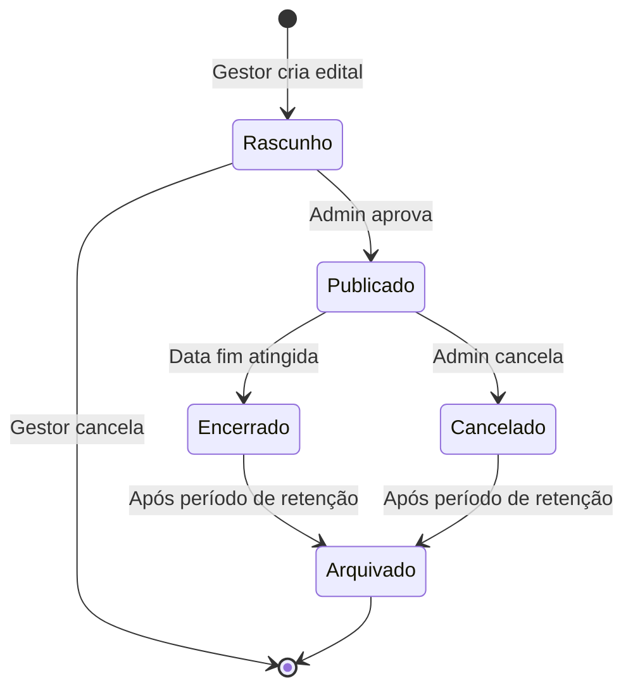

### Estados da Inscrição

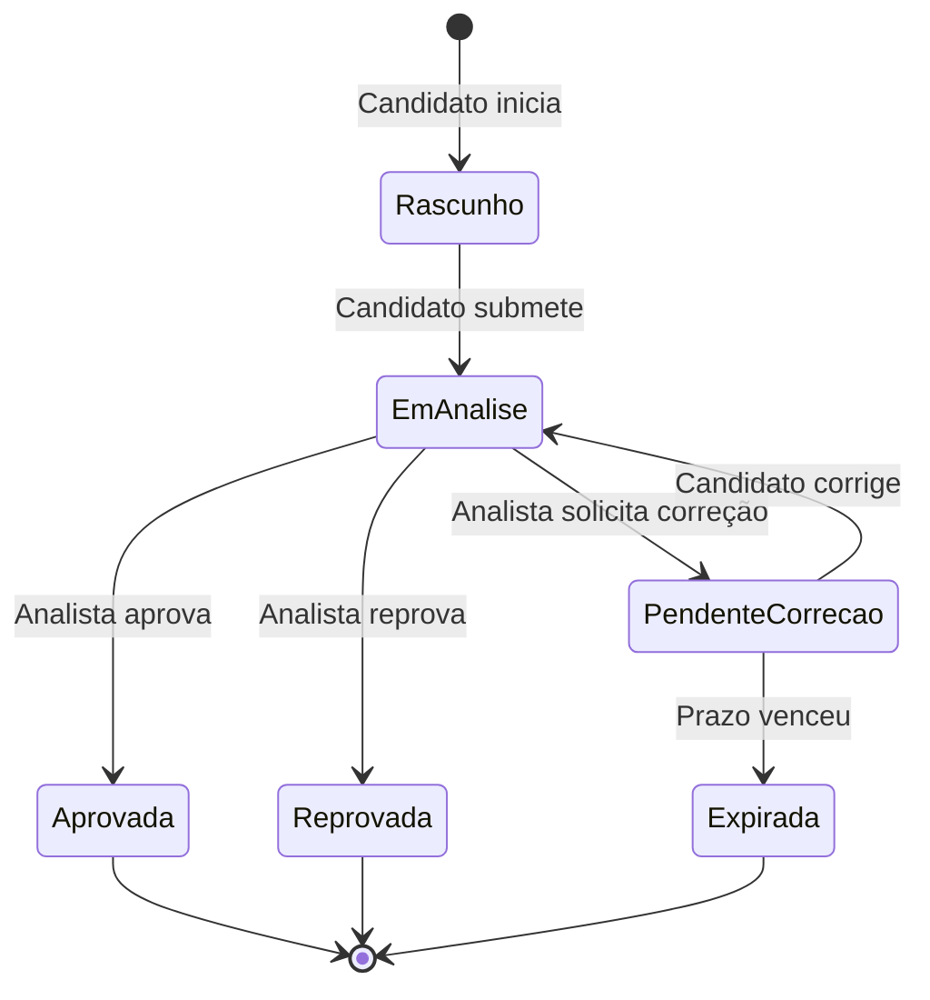

### Estados do Contrato

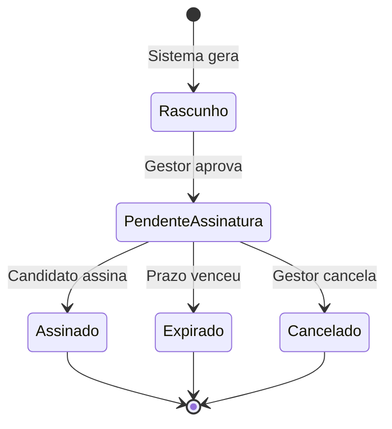

### Estados do Credenciado

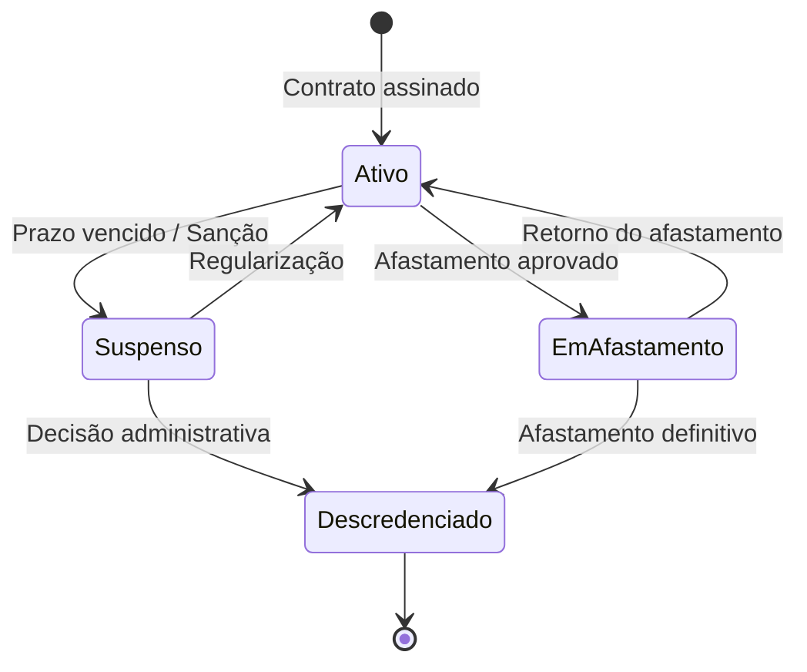

---

## Resumo de Integrações Externas

| API/Serviço | Finalidade | Fase |
|------------|-----------|------|
| **Receita Federal** | Validação de CPF/CNPJ | Fase 3, 4 |
| **CFM (Conselho Federal de Medicina)** | Validação de CRM | Fase 3, 4 |
| **DataSUS/CNES** | Validação de CNES de consultórios | Fase 3, 4 |
| **Google Maps Geocoding API** | Geocodificação de endereços | Fase 7 |
| **OpenAI Moderation API** | Moderação de avaliações públicas | Fase 8 |
| **Tesseract.js / Google Vision** | OCR de documentos | Fase 4 |
| **jsPDF / PDFKit** | Geração de PDFs (contratos, certificados) | Fase 5, 7 |
| **Supabase Storage** | Armazenamento de documentos e PDFs | Todas |
| **Supabase Realtime** | Notificações em tempo real | Todas |
| **Resend / SendGrid** | Envio de e-mails transacionais | Todas |

---

## Observações Finais

Este documento apresenta os **9 fluxos BPMN completos** do sistema de credenciamento, desde a criação do edital até o encerramento e arquivamento.

**Características principais:**
- ✅ **Swimlanes (raias)** separadas por responsável
- ✅ **Notação BPMN** com eventos, atividades, gateways
- ✅ **Operações de banco** detalhadas para cada fase
- ✅ **Edge Functions** mapeadas
- ✅ **Validações** e regras de negócio
- ✅ **Notificações** e alertas automáticos
- ✅ **Diagramas de estados** para entidades principais
- ✅ **Matriz RACI** de responsabilidades
- ✅ **Integrações externas** documentadas

**Próximos passos sugeridos:**
1. Implementar testes E2E para cada fluxo
2. Criar monitoramento de métricas (tempo de análise, taxa de aprovação, etc.)
3. Documentar casos de exceção e rollback
4. Criar playbook de troubleshooting para gestores
