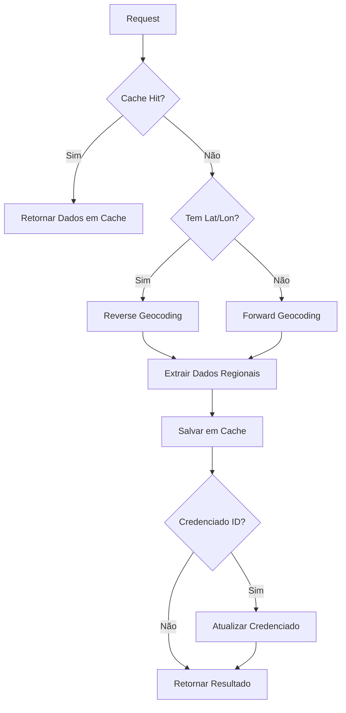

# 🗺️ Guia de Enriquecimento de Endereços via OSM

Este documento descreve a edge function `enriquecer-endereco-osm` que utiliza OpenStreetMap (OSM) Nominatim para enriquecer dados de endereço de credenciados.

---

## 📋 Índice

1. [Visão Geral](#visão-geral)
2. [Como Funciona](#como-funciona)
3. [Uso da Edge Function](#uso-da-edge-function)
4. [Rate Limiting e Políticas OSM](#rate-limiting-e-políticas-osm)
5. [Caching](#caching)
6. [Troubleshooting](#troubleshooting)
7. [Melhores Práticas](#melhores-práticas)

---

## 🎯 Visão Geral

### O que faz?

A função `enriquecer-endereco-osm` enriquece dados de endereço usando a API Nominatim do OpenStreetMap:

✅ **Reverse Geocoding**: Lat/Lon → Endereço completo  
✅ **Forward Geocoding**: Endereço → Lat/Lon + detalhes  
✅ **Extração de Dados Regionais**: Bairro, cidade, estado, CEP, país  
✅ **Cache Inteligente**: Evita requisições duplicadas  
✅ **Rate Limiting**: Respeita políticas do OSM (1 req/s)  
✅ **Retry Logic**: Tenta novamente em caso de falha temporária

---

## 🔄 Como Funciona

### Fluxo de Execução



### Dados Extraídos

| Campo | Fonte OSM | Exemplo |
|-------|-----------|---------|
| **bairro** | `suburb` ou `neighbourhood` | "Pinheiros" |
| **cidade** | `city`, `town` ou `municipality` | "São Paulo" |
| **estado** | `state` | "São Paulo" |
| **cep** | `postcode` | "01310-100" |
| **pais** | `country` | "Brasil" |
| **endereco_completo** | `display_name` | "Rua da Consolação, 123, Pinheiros, São Paulo..." |

---

## 🚀 Uso da Edge Function

### 1. Enriquecer Credenciado Existente

```typescript
const { data, error } = await supabase.functions.invoke('enriquecer-endereco-osm', {
  body: {
    credenciado_id: 'uuid-do-credenciado'
  }
});

// Response:
// {
//   success: true,
//   bairro: "Pinheiros",
//   cidade: "São Paulo",
//   estado: "São Paulo",
//   cep: "05401-000",
//   pais: "Brasil",
//   endereco_completo: "Rua da Consolação, 123...",
//   latitude: -23.5505,
//   longitude: -46.6333,
//   cached: false,
//   provider: "nominatim"
// }
```

### 2. Reverse Geocoding (Lat/Lon → Endereço)

```typescript
const { data } = await supabase.functions.invoke('enriquecer-endereco-osm', {
  body: {
    latitude: -23.5505,
    longitude: -46.6333
  }
});

// Retorna endereço completo e dados regionais
```

### 3. Forward Geocoding (Endereço → Lat/Lon)

```typescript
const { data } = await supabase.functions.invoke('enriquecer-endereco-osm', {
  body: {
    endereco: 'Avenida Paulista, 1578, São Paulo, SP'
  }
});

// Retorna lat/lon e dados regionais
```

### 4. Enriquecimento em Lote (Batch)

```typescript
// Processar múltiplos credenciados
const credenciadosIds = ['uuid1', 'uuid2', 'uuid3'];

for (const id of credenciadosIds) {
  await supabase.functions.invoke('enriquecer-endereco-osm', {
    body: { credenciado_id: id }
  });
  
  // Respeitar rate limit (1 req/s)
  await new Promise(resolve => setTimeout(resolve, 1100));
}
```

---

## ⚡ Rate Limiting e Políticas OSM

### Políticas Nominatim (CRÍTICO!)

OpenStreetMap Nominatim tem políticas **estritas** de uso:

#### 1. Rate Limit
- **Máximo**: 1 requisição por segundo
- **Implementação**: Delay automático de 1000ms entre requests
- **Violação**: Bloqueio de IP permanente

#### 2. User-Agent Obrigatório
```typescript
User-Agent: CredenciamentoSystem/1.0 (contact@example.com)
```

⚠️ **IMPORTANTE**: Substituir `contact@example.com` por email real do projeto

#### 3. Bulk Geocoding
- Para > 100 requests: usar servidor Nominatim próprio
- Alternativa: Considerar Mapbox/Google Maps API para volumes altos

#### 4. Cache Obrigatório
- **Nunca** fazer requisições duplicadas
- Implementado via tabela `geocode_cache`

### Monitoramento de Rate Limit

```sql
-- Ver últimas requisições
SELECT 
  created_at,
  address_text,
  provider,
  metadata->>'cached' as was_cached
FROM geocode_cache
WHERE provider = 'nominatim'
  AND created_at > NOW() - INTERVAL '1 hour'
ORDER BY created_at DESC;

-- Calcular requests/hora
SELECT 
  DATE_TRUNC('hour', created_at) as hora,
  COUNT(*) as total_requests,
  COUNT(*) FILTER (WHERE metadata->>'cached' = 'false') as api_calls
FROM geocode_cache
WHERE provider = 'nominatim'
  AND created_at > NOW() - INTERVAL '24 hours'
GROUP BY DATE_TRUNC('hour', created_at)
ORDER BY hora DESC;
```

---

## 💾 Caching

### Estratégia de Cache

1. **Cache Key**:
   - Reverse: `reverse_{lat}_{lon}` (6 decimais de precisão)
   - Forward: `forward_{endereco_normalizado}`

2. **Hit Count**: Rastreia quantas vezes cada cache foi reutilizado

3. **TTL**: Dados OSM raramente mudam, cache praticamente permanente

### Estatísticas de Cache

```sql
-- Ver eficiência do cache
SELECT 
  COUNT(*) as total_entries,
  COUNT(*) FILTER (WHERE hit_count > 1) as reused_entries,
  ROUND(100.0 * COUNT(*) FILTER (WHERE hit_count > 1) / COUNT(*), 2) as reuse_rate_pct,
  SUM(hit_count) as total_hits,
  AVG(hit_count) as avg_hits_per_entry
FROM geocode_cache
WHERE provider = 'nominatim';

-- Ver endereços mais consultados
SELECT 
  address_text,
  hit_count,
  created_at,
  last_used_at
FROM geocode_cache
WHERE provider = 'nominatim'
ORDER BY hit_count DESC
LIMIT 20;
```

---

## 🔍 Casos de Uso

### 1. Enriquecimento Pós-Credenciamento

Após um credenciado ser criado com lat/lon, enriquecer com dados adicionais:

```typescript
// Em um trigger ou workflow
async function onCredenciadoCreated(credenciadoId: string) {
  const { data } = await supabase.functions.invoke('enriquecer-endereco-osm', {
    body: { credenciado_id: credenciadoId }
  });
  
  console.log('Credenciado enriquecido:', data);
}
```

### 2. Corrigir Dados Incompletos

Para credenciados com endereço mas sem bairro/CEP:

```sql
-- Identificar credenciados sem bairro
SELECT id, nome, endereco, cidade
FROM credenciados
WHERE latitude IS NOT NULL
  AND (
    endereco NOT LIKE '%,%' -- Endereço simples
    OR cep IS NULL
  )
  AND status = 'Ativo'
LIMIT 50;
```

```typescript
// Enriquecer em lote
const credenciados = [/* lista de IDs */];

for (const id of credenciados) {
  await supabase.functions.invoke('enriquecer-endereco-osm', {
    body: { credenciado_id: id }
  });
  await new Promise(r => setTimeout(r, 1100)); // Rate limit
}
```

### 3. Validar Endereço Fornecido

Comparar endereço informado com o retornado pelo OSM:

```typescript
async function validateAddress(endereco: string, lat: number, lon: number) {
  const { data } = await supabase.functions.invoke('enriquecer-endereco-osm', {
    body: { latitude: lat, longitude: lon }
  });
  
  const similarity = calculateSimilarity(endereco, data.endereco_completo);
  
  if (similarity < 0.7) {
    console.warn('Endereço divergente!');
  }
}
```

---

## 🐛 Troubleshooting

### Problema: "HTTP 429 - Too Many Requests"

**Causa**: Rate limit excedido (> 1 req/s)

**Solução**:
```typescript
// Aumentar delay entre requisições
const RATE_LIMIT_DELAY = 1500; // 1.5s em vez de 1s

// Processar em lote menor
const batchSize = 50; // Processar 50 por vez com pause
```

### Problema: "User-Agent Missing"

**Causa**: Nominatim requer User-Agent válido

**Solução**:
```typescript
// Atualizar em enriquecer-endereco-osm/index.ts
const USER_AGENT = 'SeuSistema/1.0 (seu-email@dominio.com)';
```

### Problema: Resultados Imprecisos

**Causa**: Zoom level inadequado ou endereço ambíguo

**Solução**:
```typescript
// Para reverse geocoding, usar zoom=18 (máximo detalhe)
url.searchParams.set('zoom', '18');

// Para forward geocoding, ser mais específico
const enderecoEspecifico = `${rua}, ${numero}, ${bairro}, ${cidade}, ${estado}, Brasil`;
```

### Problema: Cache Nunca Usado

**Causa**: Variações pequenas em lat/lon

**Solução**:
```typescript
// Arredondar coordenadas para 6 decimais (~10cm de precisão)
const cacheKey = `reverse_${lat.toFixed(6)}_${lon.toFixed(6)}`;
```

---

## 📚 Melhores Práticas

### 1. Respeitar Políticas do OSM

✅ **SEMPRE** usar User-Agent personalizado  
✅ **NUNCA** exceder 1 req/s  
✅ **SEMPRE** cachear resultados  
✅ **EVITAR** requisições repetidas desnecessárias  

### 2. Quando Usar OSM vs. Outras APIs

| Cenário | Recomendação |
|---------|--------------|
| < 100 req/dia | ✅ OSM Nominatim (grátis) |
| 100-1000 req/dia | ⚠️ OSM + Cache agressivo |
| > 1000 req/dia | ❌ Usar Mapbox/Google Maps |
| Produção crítica | ❌ Usar API paga (SLA) |

### 3. Otimização de Lote

```typescript
// ✅ BOM: Processar com rate limit
async function enrichBatch(ids: string[]) {
  for (const id of ids) {
    await enrichCredenciado(id);
    await sleep(1100); // Respeitar rate limit
  }
}

// ❌ RUIM: Processar em paralelo (viola rate limit)
await Promise.all(ids.map(id => enrichCredenciado(id)));
```

### 4. Monitoramento Proativo

```sql
-- Alert: Muitas falhas de enriquecimento
SELECT COUNT(*) as total_falhas
FROM geocode_cache
WHERE provider = 'nominatim'
  AND metadata->>'success' = 'false'
  AND created_at > NOW() - INTERVAL '24 hours';

-- Se > 50 falhas, investigar
```

---

## 🔧 Configuração Avançada

### 1. Usar Servidor Nominatim Próprio

Para alto volume, considere instalar servidor Nominatim próprio:

```bash
# Docker Compose
version: '3'
services:
  nominatim:
    image: mediagis/nominatim:4.4
    ports:
      - "8080:8080"
    environment:
      PBF_URL: https://download.geofabrik.de/south-america/brazil-latest.osm.pbf
      REPLICATION_URL: https://download.geofabrik.de/south-america/brazil-updates/
    volumes:
      - nominatim-data:/var/lib/postgresql/14/main

volumes:
  nominatim-data:
```

Atualizar edge function:
```typescript
const NOMINATIM_BASE_URL = Deno.env.get('NOMINATIM_URL') || 'https://nominatim.openstreetmap.org';
```

### 2. Fallback para Mapbox

Para alta disponibilidade, adicionar fallback:

```typescript
async function geocodeWithFallback(lat: number, lon: number) {
  try {
    return await reverseGeocodeNominatim(lat, lon);
  } catch (error) {
    console.warn('[FALLBACK] Nominatim falhou, tentando Mapbox');
    return await reverseGeocodeMapbox(lat, lon);
  }
}
```

### 3. Enriquecimento Automático

Trigger para enriquecer automaticamente após geocodificação:

```sql
CREATE OR REPLACE FUNCTION auto_enrich_credenciado()
RETURNS TRIGGER
LANGUAGE plpgsql
SECURITY DEFINER
AS $$
BEGIN
  -- Se latitude foi preenchida e não tem bairro, enriquecer
  IF NEW.latitude IS NOT NULL AND OLD.latitude IS NULL THEN
    PERFORM net.http_post(
      url := current_setting('app.supabase_url') || '/functions/v1/enriquecer-endereco-osm',
      headers := jsonb_build_object(
        'Content-Type', 'application/json',
        'Authorization', 'Bearer ' || current_setting('app.service_role_key')
      ),
      body := jsonb_build_object('credenciado_id', NEW.id)
    );
  END IF;
  
  RETURN NEW;
END;
$$;

CREATE TRIGGER trigger_auto_enrich
AFTER UPDATE ON credenciados
FOR EACH ROW
EXECUTE FUNCTION auto_enrich_credenciado();
```

---

## 📊 Métricas e Observabilidade

### KPIs

| Métrica | Meta | Alerta |
|---------|------|--------|
| Taxa de Sucesso | ≥ 95% | < 90% |
| Taxa de Cache Hit | ≥ 60% | < 40% |
| Latência Média | < 2s | > 5s |
| Requests/Hora | < 3600 | > 3000 |

### Dashboard de Monitoramento

```sql
-- Estatísticas de enriquecimento (últimas 24h)
SELECT 
  COUNT(*) as total_requests,
  COUNT(*) FILTER (WHERE metadata->>'success' = 'true') as successful,
  COUNT(*) FILTER (WHERE metadata->>'cached' = 'true') as cache_hits,
  ROUND(100.0 * COUNT(*) FILTER (WHERE metadata->>'cached' = 'true') / COUNT(*), 2) as cache_hit_rate_pct,
  AVG(CASE WHEN metadata->>'success' = 'true' THEN 1 ELSE 0 END) * 100 as success_rate_pct
FROM geocode_cache
WHERE provider = 'nominatim'
  AND created_at > NOW() - INTERVAL '24 hours';
```

---

## 🛡️ Conformidade com OSM

### Termos de Uso Nominatim

Baseado em: https://operations.osmfoundation.org/policies/nominatim/

✅ **Permitido**:
- Uso para aplicações web/mobile
- Cache de resultados
- Uso comercial (com limitações)

❌ **Proibido**:
- Requisições sem User-Agent
- Geocoding em lote massivo (use servidor próprio)
- Requisições automatizadas sem delay

### Atribuição Obrigatória

Incluir em UI do mapa:

```html
<div class="map-attribution">
  Dados de endereço © OpenStreetMap contributors
</div>
```

```css
.map-attribution {
  position: absolute;
  bottom: 10px;
  right: 10px;
  background: rgba(255, 255, 255, 0.8);
  padding: 4px 8px;
  border-radius: 4px;
  font-size: 11px;
  color: #333;
}
```

---

## 🎯 Exemplos Práticos

### Exemplo 1: Preencher Bairros Faltantes

```sql
-- 1. Identificar credenciados sem bairro
SELECT id, nome, endereco, cidade
FROM credenciados
WHERE latitude IS NOT NULL
  AND endereco NOT LIKE '%,%,%'  -- Endereço simples
  AND status = 'Ativo'
LIMIT 100;
```

```typescript
// 2. Enriquecer via API
async function fillMissingBairros() {
  const { data: credenciados } = await supabase
    .from('credenciados')
    .select('id')
    .not('latitude', 'is', null)
    .eq('status', 'Ativo')
    .limit(100);

  for (const c of credenciados || []) {
    await supabase.functions.invoke('enriquecer-endereco-osm', {
      body: { credenciado_id: c.id }
    });
    
    await new Promise(r => setTimeout(r, 1100));
    console.log(`✅ Enriquecido: ${c.id}`);
  }
}
```

### Exemplo 2: Validação de CEP

```typescript
async function validateCEP(credenciadoId: string, cepInformado: string) {
  const { data } = await supabase.functions.invoke('enriquecer-endereco-osm', {
    body: { credenciado_id: credenciadoId }
  });

  if (data.cep && data.cep !== cepInformado) {
    console.warn(`CEP divergente! Informado: ${cepInformado}, OSM: ${data.cep}`);
    return {
      valido: false,
      cep_osm: data.cep,
      cep_informado: cepInformado,
    };
  }

  return { valido: true };
}
```

### Exemplo 3: Enriquecimento Preventivo

```typescript
// Ao criar credenciado, já enriquecer
async function createCredenciadoWithEnrichment(dados: any) {
  // 1. Criar credenciado
  const { data: credenciado } = await supabase
    .from('credenciados')
    .insert(dados)
    .select()
    .single();

  // 2. Se tem lat/lon, enriquecer imediatamente
  if (credenciado.latitude && credenciado.longitude) {
    await supabase.functions.invoke('enriquecer-endereco-osm', {
      body: { credenciado_id: credenciado.id }
    });
  }

  return credenciado;
}
```

---

## 📈 Alternativas e Comparação

| Provider | Preço | Rate Limit | Precisão | SLA |
|----------|-------|------------|----------|-----|
| **OSM Nominatim** | Grátis | 1 req/s | Boa | Nenhum |
| **Mapbox Geocoding** | $0.50/1k | 600 req/min | Excelente | 99.9% |
| **Google Maps** | $5/1k | Alta | Excelente | 99.9% |
| **Nominatim Self-Hosted** | Servidor | Ilimitado | Boa | Seu |

**Recomendação**:
- **Desenvolvimento/MVP**: OSM Nominatim (grátis)
- **Produção (<1k/dia)**: OSM + Cache robusto
- **Produção (>1k/dia)**: Mapbox ou Google Maps
- **Enterprise**: Nominatim self-hosted

---

## 🔗 Recursos

- [Nominatim API Docs](https://nominatim.org/release-docs/latest/api/Overview/)
- [OSM Usage Policy](https://operations.osmfoundation.org/policies/nominatim/)
- [Mapbox Geocoding](https://docs.mapbox.com/api/search/geocoding/)
- [Google Geocoding](https://developers.google.com/maps/documentation/geocoding)

---

**Tempo estimado de implementação**: 30 minutos  
**Última atualização**: 2025-01-09
