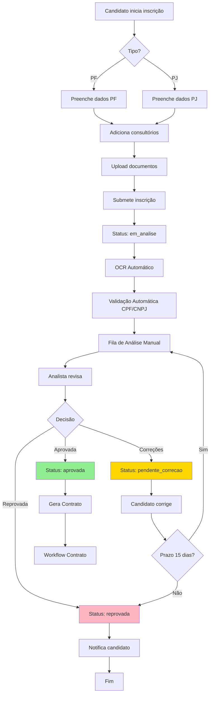
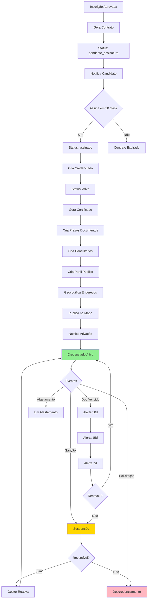
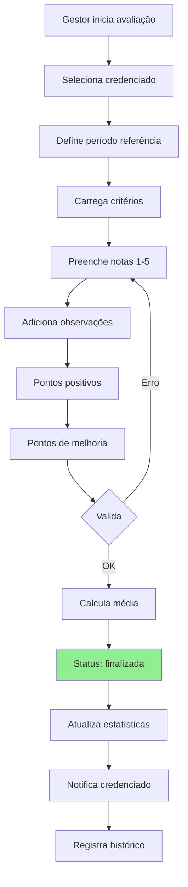
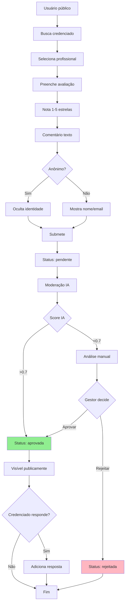
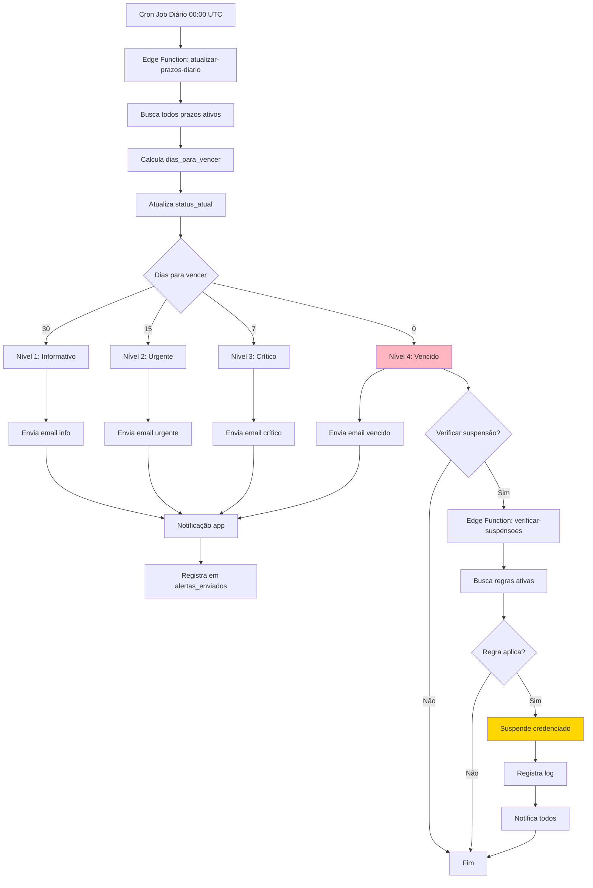
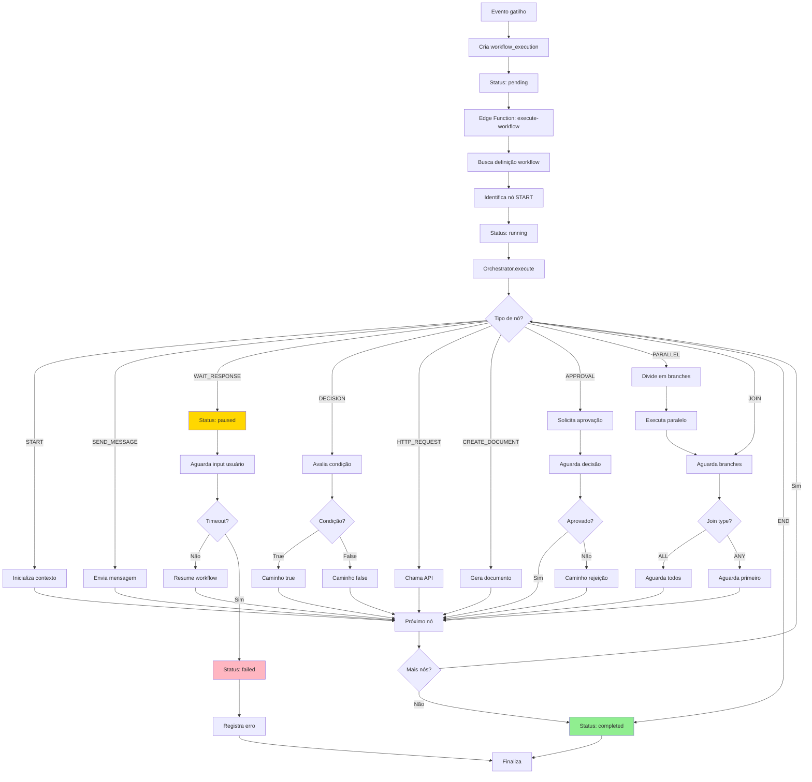
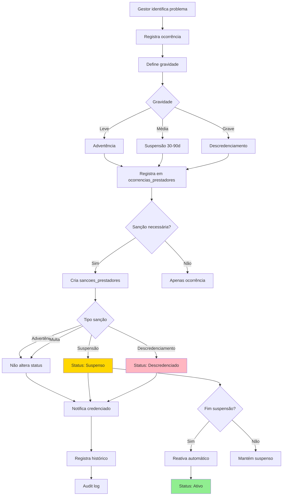
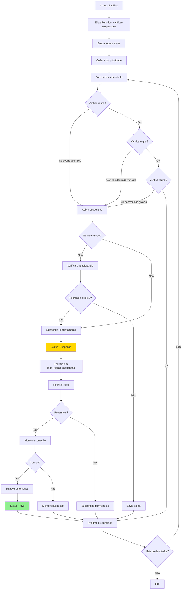
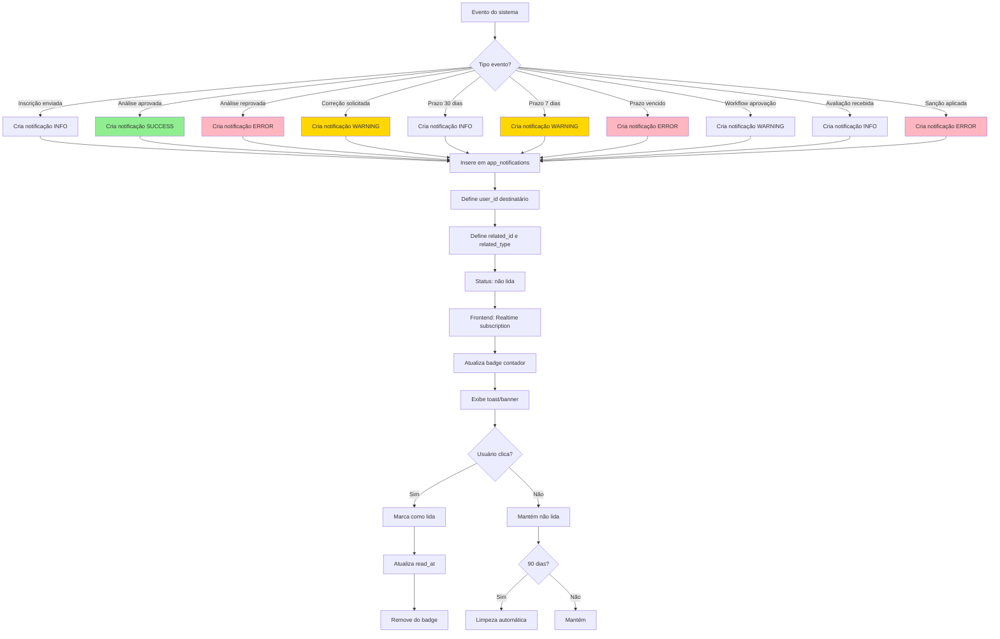

# Fluxos de Processos por Módulo

## 1. Fluxo de Inscrição Completo

## 2. Fluxo de Credenciamento

## 3. Fluxo de Avaliações

### 3.1 Avaliação Interna (Prestadores)

### 3.2 Avaliação Pública

## 4. Fluxo de Prazos e Alertas

## 5. Fluxo de Workflow

## 6. Fluxo de Sanções e Ocorrências

## 7. Fluxo de Suspensão Automática

## 8. Fluxo de Notificações

## Legenda de Cores

- 🟢 Verde: Status de sucesso/ativo
- 🔴 Vermelho: Status de erro/reprovado/descredenciado
- 🟡 Amarelo: Status de atenção/pendente/suspenso
