# Fluxos de Processos por Módulo

## 1. Fluxo de Inscrição Completo

```mermaid
flowchart TD
    A[Candidato inicia inscrição] --> B{Tipo?}
    B -->|PF| C[Preenche dados PF]
    B -->|PJ| D[Preenche dados PJ]
    C --> E[Adiciona consultórios]
    D --> E
    E --> F[Upload documentos]
    F --> G[Submete inscrição]
    G --> H[Status: em_analise]
    H --> I[OCR Automático]
    I --> J[Validação Automática CPF/CNPJ]
    J --> K[Fila de Análise Manual]
    K --> L[Analista revisa]
    L --> M{Decisão}
    M -->|Aprovada| N[Status: aprovada]
    M -->|Reprovada| O[Status: reprovada]
    M -->|Correções| P[Status: pendente_correcao]
    P --> Q[Candidato corrige]
    Q --> R{Prazo 15 dias?}
    R -->|Sim| K
    R -->|Não| O
    N --> S[Gera Contrato]
    S --> T[Workflow Contrato]
    O --> U[Notifica candidato]
    U --> V[Fim]
    
    style N fill:#90EE90
    style O fill:#FFB6C1
    style P fill:#FFD700
```

## 2. Fluxo de Credenciamento

```mermaid
flowchart TD
    A[Inscrição Aprovada] --> B[Gera Contrato]
    B --> C[Status: pendente_assinatura]
    C --> D[Notifica Candidato]
    D --> E{Assina em 30 dias?}
    E -->|Sim| F[Status: assinado]
    E -->|Não| G[Contrato Expirado]
    F --> H[Cria Credenciado]
    H --> I[Status: Ativo]
    I --> J[Gera Certificado]
    J --> K[Cria Prazos Documentos]
    K --> L[Cria Consultórios]
    L --> M[Cria Perfil Público]
    M --> N[Geocodifica Endereços]
    N --> O[Publica no Mapa]
    O --> P[Notifica Ativação]
    P --> Q[Credenciado Ativo]
    
    Q --> R{Eventos}
    R -->|Doc Vencido| S[Alerta 30d]
    R -->|Sanção| T[Suspensão]
    R -->|Afastamento| U[Em Afastamento]
    R -->|Solicitação| V[Descredenciamento]
    
    S --> W[Alerta 15d]
    W --> X[Alerta 7d]
    X --> Y{Renovou?}
    Y -->|Sim| Q
    Y -->|Não| T
    
    T --> Z{Reversível?}
    Z -->|Sim| AA[Gestor Reativa]
    Z -->|Não| V
    AA --> Q
    
    style Q fill:#90EE90
    style T fill:#FFD700
    style V fill:#FFB6C1
```

## 3. Fluxo de Avaliações

### 3.1 Avaliação Interna (Prestadores)

```mermaid
flowchart TD
    A[Gestor inicia avaliação] --> B[Seleciona credenciado]
    B --> C[Define período referência]
    C --> D[Carrega critérios]
    D --> E[Preenche notas 1-5]
    E --> F[Adiciona observações]
    F --> G[Pontos positivos]
    G --> H[Pontos de melhoria]
    H --> I{Valida}
    I -->|OK| J[Calcula média]
    I -->|Erro| E
    J --> K[Status: finalizada]
    K --> L[Atualiza estatísticas]
    L --> M[Notifica credenciado]
    M --> N[Registra histórico]
    
    style K fill:#90EE90
```

### 3.2 Avaliação Pública

```mermaid
flowchart TD
    A[Usuário público] --> B[Busca credenciado]
    B --> C[Seleciona profissional]
    C --> D[Preenche avaliação]
    D --> E[Nota 1-5 estrelas]
    E --> F[Comentário texto]
    F --> G{Anônimo?}
    G -->|Sim| H[Oculta identidade]
    G -->|Não| I[Mostra nome/email]
    H --> J[Submete]
    I --> J
    J --> K[Status: pendente]
    K --> L[Moderação IA]
    L --> M{Score IA}
    M -->|>0.7| N[Status: aprovada]
    M -->|<0.7| O[Análise manual]
    O --> P{Gestor decide}
    P -->|Aprovar| N
    P -->|Rejeitar| Q[Status: rejeitada]
    N --> R[Visível publicamente]
    R --> S{Credenciado responde?}
    S -->|Sim| T[Adiciona resposta]
    S -->|Não| U[Fim]
    T --> U
    Q --> U
    
    style N fill:#90EE90
    style Q fill:#FFB6C1
```

## 4. Fluxo de Prazos e Alertas

## 5. Fluxo de Workflow

```mermaid
flowchart TD
    A[Evento gatilho] --> B[Cria workflow_execution]
    B --> C[Status: pending]
    C --> D[Edge Function: execute-workflow]
    D --> E[Busca definição workflow]
    E --> F[Identifica nó START]
    F --> G[Status: running]
    G --> H[Orchestrator.execute]
    
    H --> I{Tipo de nó?}
    
    I -->|START| J[Inicializa contexto]
    I -->|SEND_MESSAGE| K[Envia mensagem]
    I -->|WAIT_RESPONSE| L[Status: paused]
    I -->|DECISION| M[Avalia condição]
    I -->|HTTP_REQUEST| N[Chama API]
    I -->|CREATE_DOCUMENT| O[Gera documento]
    I -->|APPROVAL| P[Solicita aprovação]
    I -->|PARALLEL| Q[Divide em branches]
    I -->|JOIN| R[Aguarda branches]
    I -->|END| S[Status: completed]
    
    J --> T[Próximo nó]
    K --> T
    N --> T
    O --> T
    
    L --> U[Aguarda input usuário]
    U --> V{Timeout?}
    V -->|Não| W[Resume workflow]
    V -->|Sim| X[Status: failed]
    W --> T
    
    P --> Y[Aguarda decisão]
    Y --> Z{Aprovado?}
    Z -->|Sim| T
    Z -->|Não| AA[Caminho rejeição]
    AA --> T
    
    M --> AB{Condição?}
    AB -->|True| AC[Caminho true]
    AB -->|False| AD[Caminho false]
    AC --> T
    AD --> T
    
    Q --> AE[Executa paralelo]
    AE --> R
    R --> AF{Join type?}
    AF -->|ALL| AG[Aguarda todos]
    AF -->|ANY| AH[Aguarda primeiro]
    AG --> T
    AH --> T
    
    T --> AI{Mais nós?}
    AI -->|Sim| I
    AI -->|Não| S
    
    S --> AJ[Finaliza]
    X --> AK[Registra erro]
    AK --> AJ
    
    style S fill:#90EE90
    style X fill:#FFB6C1
    style L fill:#FFD700
```

## 6. Fluxo de Sanções e Ocorrências

```mermaid
flowchart TD
    A[Gestor identifica problema] --> B[Registra ocorrência]
    B --> C[Define gravidade]
    C --> D{Gravidade}
    
    D -->|Leve| E[Advertência]
    D -->|Média| F[Suspensão 30-90d]
    D -->|Grave| G[Descredenciamento]
    
    E --> H[Registra em ocorrencias_prestadores]
    F --> H
    G --> H
    
    H --> I{Sanção necessária?}
    I -->|Sim| J[Cria sancoes_prestadores]
    I -->|Não| K[Apenas ocorrência]
    
    J --> L{Tipo sanção}
    L -->|Advertência| M[Não altera status]
    L -->|Suspensão| N[Status: Suspenso]
    L -->|Multa| M
    L -->|Descredenciamento| O[Status: Descredenciado]
    
    M --> P[Notifica credenciado]
    N --> P
    O --> P
    
    P --> Q[Registra histórico]
    Q --> R[Audit log]
    
    N --> S{Fim suspensão?}
    S -->|Sim| T[Reativa automático]
    S -->|Não| U[Mantém suspenso]
    
    T --> V[Status: Ativo]
    
    style O fill:#FFB6C1
    style N fill:#FFD700
    style V fill:#90EE90
```

## 7. Fluxo de Suspensão Automática

```mermaid
flowchart TD
    A[Cron Job Diário] --> B[Edge Function: verificar-suspensoes]
    B --> C[Busca regras ativas]
    C --> D[Ordena por prioridade]
    D --> E[Para cada credenciado]
    E --> F{Verifica regra 1}
    
    F -->|Doc vencido crítico| G[Aplica suspensão]
    F -->|OK| H{Verifica regra 2}
    
    H -->|Cert regularidade vencido| G
    H -->|OK| I{Verifica regra 3}
    
    I -->|3+ ocorrências graves| G
    I -->|OK| J[Próximo credenciado]
    
    G --> K{Notificar antes?}
    K -->|Sim| L[Verifica dias tolerância]
    K -->|Não| M[Suspende imediatamente]
    
    L --> N{Tolerância expirou?}
    N -->|Sim| M
    N -->|Não| O[Envia alerta]
    
    M --> P[Status: Suspenso]
    P --> Q[Registra em logs_regras_suspensao]
    Q --> R[Notifica todos]
    R --> S{Reversível?}
    
    S -->|Sim| T[Monitora correção]
    S -->|Não| U[Suspensão permanente]
    
    T --> V{Corrigiu?}
    V -->|Sim| W[Reativa automático]
    V -->|Não| X[Mantém suspenso]
    
    W --> Y[Status: Ativo]
    
    O --> J
    X --> J
    U --> J
    Y --> J
    
    J --> Z{Mais credenciados?}
    Z -->|Sim| E
    Z -->|Não| AA[Fim]
    
    style P fill:#FFD700
    style Y fill:#90EE90
```

## 8. Fluxo de Notificações

```mermaid
flowchart TD
    A[Evento do sistema] --> B{Tipo evento?}
    
    B -->|Inscrição enviada| C[Cria notificação INFO]
    B -->|Análise aprovada| D[Cria notificação SUCCESS]
    B -->|Análise reprovada| E[Cria notificação ERROR]
    B -->|Correção solicitada| F[Cria notificação WARNING]
    B -->|Prazo 30 dias| G[Cria notificação INFO]
    B -->|Prazo 7 dias| H[Cria notificação WARNING]
    B -->|Prazo vencido| I[Cria notificação ERROR]
    B -->|Workflow aprovação| J[Cria notificação WARNING]
    B -->|Avaliação recebida| K[Cria notificação INFO]
    B -->|Sanção aplicada| L[Cria notificação ERROR]
    
    C --> M[Insere em app_notifications]
    D --> M
    E --> M
    F --> M
    G --> M
    H --> M
    I --> M
    J --> M
    K --> M
    L --> M
    
    M --> N[Define user_id destinatário]
    N --> O[Define related_id e related_type]
    O --> P[Status: não lida]
    
    P --> Q[Frontend: Realtime subscription]
    Q --> R[Atualiza badge contador]
    R --> S[Exibe toast/banner]
    
    S --> T{Usuário clica?}
    T -->|Sim| U[Marca como lida]
    T -->|Não| V[Mantém não lida]
    
    U --> W[Atualiza read_at]
    W --> X[Remove do badge]
    
    V --> Y{90 dias?}
    Y -->|Sim| Z[Limpeza automática]
    Y -->|Não| AA[Mantém]
    
    style D fill:#90EE90
    style E fill:#FFB6C1
    style F fill:#FFD700
    style H fill:#FFD700
    style I fill:#FFB6C1
    style L fill:#FFB6C1
```

## Legenda de Cores

- 🟢 Verde: Status de sucesso/ativo
- 🔴 Vermelho: Status de erro/reprovado/descredenciado
- 🟡 Amarelo: Status de atenção/pendente/suspenso
