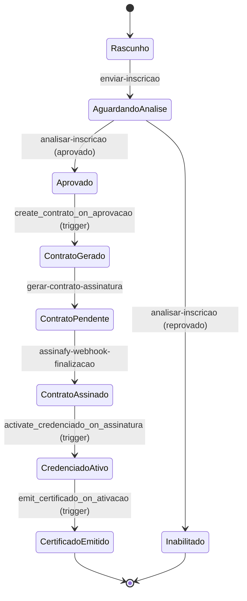

# Fluxo Programático de Credenciamento

## 📋 Visão Geral

Este documento descreve o **Fluxo Programático** de credenciamento, uma alternativa simplificada ao Workflow Engine que executa o processo de credenciamento através de lógica direta (triggers + edge functions).

## 🎯 Objetivo

Permitir que o processo de credenciamento funcione de forma **100% funcional** sem dependência do Workflow Engine, tornando o sistema:
- ✅ Mais simples de manter
- ✅ Mais fácil de debugar
- ✅ Mais rápido de executar
- ✅ Mais transparente nos logs

---

## 🔄 Diagrama de Estados



---

## ⚙️ Componentes do Fluxo

### **Edge Functions**

| # | Nome | Descrição | Input | Output |
|---|------|-----------|-------|--------|
| 1 | `publicar-edital` | Publica edital, tornando-o disponível | `{ edital_id }` | `{ success, edital_id }` |
| 2 | `enviar-inscricao` | Submete inscrição para análise | `{ inscricao_id }` | `{ success, inscricao_id, status }` |
| 3 | `analisar-inscricao` | Aprova/rejeita inscrição | `{ inscricao_id, decisao, observacoes }` | `{ success, status }` |
| 4 | `gerar-contrato-assinatura` | Gera contrato e envia para Assinafy | `{ inscricao_id }` | `{ success, contrato_id, assinafy_id }` |
| 5 | `assinafy-webhook-finalizacao` | Processa callbacks do Assinafy | `{ event, metadata }` | `{ success }` |
| 6 | `gerar-certificado-credenciamento` | Emite certificado PDF | `{ credenciado_id }` | `{ success, certificado_url }` |

### **Database Triggers**

| # | Nome | Tabela | Evento | Ação |
|---|------|--------|--------|------|
| 1 | `create_analise_on_inscricao` | `inscricoes_edital` | INSERT/UPDATE | Cria registro em `analises` quando status = `aguardando_analise` |
| 2 | `create_contrato_on_aprovacao` | `analises` | UPDATE | Cria contrato quando inscrição é aprovada |
| 3 | `activate_credenciado_on_assinatura` | `contratos` | UPDATE | Cria/ativa credenciado quando contrato é assinado |
| 4 | `emit_certificado_on_ativacao` | `credenciados` | UPDATE | Emite certificado quando credenciado é ativado |

---

## 📊 Fluxo Detalhado (Step-by-Step)

### **1️⃣ Criação do Edital**
```sql
-- Gestor cria edital SEM workflow_id
INSERT INTO editais (titulo, status, workflow_id)
VALUES ('Credenciamento 2025', 'rascunho', NULL);
```

**Edge Function:** `publicar-edital`
```typescript
// Publica edital
await supabase.from('editais')
  .update({ status: 'aberto' })
  .eq('id', edital_id);
```

---

### **2️⃣ Inscrição do Candidato**
```sql
-- Candidato cria inscrição
INSERT INTO inscricoes_edital (edital_id, candidato_id, status, is_rascunho)
VALUES ('edital-uuid', 'candidato-uuid', 'rascunho', true);
```

**Edge Function:** `enviar-inscricao`
```typescript
// Submete inscrição
await supabase.from('inscricoes_edital')
  .update({ 
    status: 'aguardando_analise',
    is_rascunho: false 
  })
  .eq('id', inscricao_id);
```

**Trigger automático:** `create_analise_on_inscricao`
```sql
-- Cria registro de análise automaticamente
INSERT INTO analises (inscricao_id, status)
VALUES (NEW.id, 'pendente');
```

---

### **3️⃣ Análise pelo Analista**

**Edge Function:** `analisar-inscricao`
```typescript
if (decisao === 'aprovada') {
  await supabase.from('analises')
    .update({ status: 'aprovada' })
    .eq('inscricao_id', inscricao_id);
  
  // Chama função de geração de contrato
  await supabase.functions.invoke('gerar-contrato-assinatura', {
    body: { inscricao_id }
  });
} else {
  await supabase.from('inscricoes_edital')
    .update({ status: 'inabilitado' })
    .eq('id', inscricao_id);
}
```

**Trigger automático:** `create_contrato_on_aprovacao`
```sql
-- Quando análise é aprovada, cria registro de contrato
INSERT INTO contratos (inscricao_id, analise_id, status)
VALUES (NEW.inscricao_id, NEW.id, 'pendente_assinatura');
```

---

### **4️⃣ Geração de Contrato**

**Edge Function:** `gerar-contrato-assinatura`
```typescript
// 1. Gerar HTML do contrato
const html = gerarContratoHTML(dadosInscricao);

// 2. Salvar em contratos
await supabase.from('contratos').insert({
  inscricao_id,
  documento_url: html_url,
  status: 'pendente_assinatura'
});

// 3. Enviar para Assinafy
await fetch('https://api.assinafy.com.br/v1/documents', {
  method: 'POST',
  body: JSON.stringify({
    name: 'Contrato de Credenciamento',
    document_url: html_url,
    signers: [{ email, name }],
    metadata: { inscricao_id }
  })
});

// 4. Salvar signature_request
await supabase.from('signature_requests').insert({
  workflow_execution_id: null, // Fluxo programático
  external_id: assinafy_response.id,
  status: 'pending'
});
```

---

### **5️⃣ Assinatura do Contrato (Webhook Assinafy)**

**Edge Function:** `assinafy-webhook-finalizacao`
```typescript
// Recebe evento do Assinafy
if (evento.type === 'document.signed') {
  const { inscricao_id } = evento.metadata;
  
  // Atualizar signature_request
  await supabase.from('signature_requests')
    .update({ 
      status: 'signed',
      completed_at: new Date() 
    })
    .eq('external_id', evento.id);
  
  // Atualizar contrato
  await supabase.from('contratos')
    .update({ status: 'assinado' })
    .eq('inscricao_id', inscricao_id);
}
```

**Trigger automático:** `activate_credenciado_on_assinatura`
```sql
-- Quando contrato é assinado, cria/ativa credenciado
INSERT INTO credenciados (inscricao_id, nome, cpf, status)
VALUES (NEW.inscricao_id, dados.nome, dados.cpf, 'Ativo')
ON CONFLICT (inscricao_id) 
DO UPDATE SET status = 'Ativo';
```

---

### **6️⃣ Emissão de Certificado**

**Trigger automático:** `emit_certificado_on_ativacao`
```sql
-- Quando credenciado é ativado, cria certificado
INSERT INTO certificados (credenciado_id, numero_certificado, status)
VALUES (NEW.id, 'CERT-2025-XXXXX', 'ativo');
```

**Edge Function:** `gerar-certificado-credenciamento`
```typescript
// Gerar PDF do certificado
const pdf = await gerarCertificadoPDF(credenciado);

// Salvar certificado
await supabase.from('certificados').insert({
  credenciado_id,
  numero_certificado: `CERT-${year}-${random}`,
  documento_url: pdf_url,
  status: 'ativo'
});

// Enviar e-mail com certificado
await resend.emails.send({
  to: credenciado.email,
  subject: 'Certificado de Credenciamento',
  attachments: [{ filename: 'certificado.pdf', content: pdf }]
});
```

---

## 🧪 Testes E2E

### **Checklist de Validação**

- [ ] 1. Criar edital SEM `workflow_id` (via UI ou SQL)
- [ ] 2. Verificar que edital pode ser publicado via `publicar-edital`
- [ ] 3. Criar inscrição vinculada ao edital
- [ ] 4. Submeter inscrição via `enviar-inscricao`
- [ ] 5. Verificar que análise foi criada automaticamente (trigger)
- [ ] 6. Aprovar inscrição via `analisar-inscricao`
- [ ] 7. Verificar que contrato foi criado (trigger)
- [ ] 8. Verificar que `signature_request` foi criado
- [ ] 9. Simular webhook Assinafy (`document.signed`)
- [ ] 10. Verificar que credenciado foi ativado (trigger)
- [ ] 11. Verificar que certificado foi emitido (trigger)
- [ ] 12. Baixar PDF do certificado
- [ ] 13. Verificar notificações enviadas em cada etapa

### **Comandos SQL para Diagnóstico**

```sql
-- Ver status da inscrição
SELECT id, status, is_rascunho, workflow_execution_id
FROM inscricoes_edital
WHERE id = 'inscricao-uuid';

-- Ver análise criada
SELECT id, inscricao_id, status, analisado_em
FROM analises
WHERE inscricao_id = 'inscricao-uuid';

-- Ver contrato gerado
SELECT id, inscricao_id, status, assinado_em
FROM contratos
WHERE inscricao_id = 'inscricao-uuid';

-- Ver credenciado ativado
SELECT id, inscricao_id, nome, status
FROM credenciados
WHERE inscricao_id = 'inscricao-uuid';

-- Ver certificado emitido
SELECT c.id, c.numero_certificado, c.status, cr.nome
FROM certificados c
JOIN credenciados cr ON cr.id = c.credenciado_id
WHERE cr.inscricao_id = 'inscricao-uuid';
```

---

## 🆚 Comparação: Workflow Engine vs. Fluxo Programático

| Característica | Workflow Engine | Fluxo Programático |
|----------------|-----------------|-------------------|
| **Complexidade** | ⭐⭐⭐⭐⭐ (muito alto) | ⭐⭐ (baixo) |
| **Setup inicial** | ~6h (implementação atual) | ~3h30 (este fluxo) |
| **Manutenção** | Requer editor visual + DB | Código TypeScript direto |
| **Performance** | Overhead de orquestração | Direto (triggers + functions) |
| **Debuggabilidade** | Checkpoints, logs complexos | Logs simples por step |
| **Flexibilidade** | Editor drag-and-drop | Código (menos flexível) |
| **Observabilidade** | `workflow_executions`, `workflow_events` | Logs de edge functions + triggers |
| **Retry logic** | Automático (workflow engine) | Manual (via edge functions) |
| **Testabilidade** | Requer setup completo | Cada function testável isoladamente |
| **Tempo de execução** | ~5-10s por step (overhead) | ~1-2s por step (direto) |

---

## 🔧 Configuração Necessária

### **Variáveis de Ambiente**
```bash
ASSINAFY_API_KEY=sk_xxxxx
ASSINAFY_ACCOUNT_ID=acc_xxxxx
ASSINAFY_WEBHOOK_SECRET=whsec_xxxxx
RESEND_API_KEY=re_xxxxx
```

### **Edge Functions a Deployar**
```bash
supabase/functions/publicar-edital
supabase/functions/enviar-inscricao
supabase/functions/analisar-inscricao (já existe)
supabase/functions/gerar-contrato-assinatura (já existe)
supabase/functions/assinafy-webhook-finalizacao (já existe)
supabase/functions/gerar-certificado-credenciamento (já existe)
```

### **Configuração no supabase/config.toml**
```toml
[functions.publicar-edital]
verify_jwt = true

[functions.enviar-inscricao]
verify_jwt = true
```

---

## 📚 Próximos Passos

1. ✅ **Implementação completa** (FASE 1-6)
2. ⏳ **Testes E2E** em ambiente de staging
3. ⏳ **Monitoramento** por 2-4 semanas
4. ⏳ **Decisão**: manter fluxo programático ou voltar ao workflow engine

---

## 🐛 Troubleshooting

### **Problema: Inscrição não avança após envio**
```sql
-- Verificar se trigger está habilitado
SELECT tgname, tgenabled 
FROM pg_trigger 
WHERE tgrelid = 'inscricoes_edital'::regclass;

-- Se desabilitado, reabilitar
ALTER TABLE inscricoes_edital ENABLE TRIGGER create_analise_on_inscricao_trigger;
```

### **Problema: Contrato não é gerado após aprovação**
```sql
-- Verificar se função analisar-inscricao está sendo chamada
-- Ver logs da edge function no Supabase Dashboard
```

### **Problema: Certificado não é emitido**
```sql
-- Verificar se credenciado foi ativado
SELECT status FROM credenciados WHERE inscricao_id = 'uuid';

-- Verificar se trigger está habilitado
SELECT tgname FROM pg_trigger WHERE tgrelid = 'credenciados'::regclass;
```

---

## 📞 Contato

Para dúvidas ou suporte sobre o fluxo programático, consulte:
- [Logs das Edge Functions](https://supabase.com/dashboard/project/ncmofeencqpqhtguxmvy/logs)
- [Documentação Assinafy](https://docs.assinafy.com.br)
- [Código-fonte no repositório](/)
