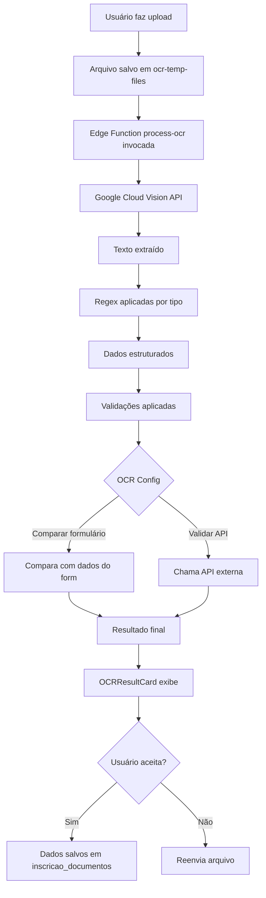

# Sistema OCR - Documentação Completa

## Visão Geral

O sistema OCR (Optical Character Recognition) permite extrair dados automaticamente de documentos enviados pelos candidatos durante o processo de inscrição, validando campos obrigatórios e comparando com dados já fornecidos.

## Configuração da Google Cloud Vision API

### 1. Criar projeto no Google Cloud Console

1. Acesse [Google Cloud Console](https://console.cloud.google.com/)
2. Crie um novo projeto ou selecione um existente
3. Ative a **Cloud Vision API** no projeto
4. Vá em **APIs & Services** → **Credentials**
5. Crie uma **API Key**
6. Copie a chave gerada

### 2. Adicionar a chave no Supabase

A chave já foi configurada como secret `GOOGLE_CLOUD_VISION_API_KEY` no Supabase.

Para atualizar:
```bash
# Via Supabase CLI
supabase secrets set GOOGLE_CLOUD_VISION_API_KEY=sua_chave_aqui

# Ou via dashboard Lovable Cloud
Settings → Secrets → Atualizar GOOGLE_CLOUD_VISION_API_KEY
```

## Tipos de Documento Suportados

O sistema suporta os seguintes documentos brasileiros:

| Tipo | Campos Extraídos | Regex |
|------|-----------------|-------|
| **RG** | nome, rg, cpf, data_nascimento, orgao_emissor, uf | Múltiplas regex |
| **CNH** | nome, cpf, numero_cnh, categoria, data_nascimento, validade | Múltiplas regex |
| **CPF** | cpf, nome | Múltiplas regex |
| **CRM** | nome, crm, uf_crm, especialidade | Múltiplas regex |
| **CNPJ** | cnpj, razao_social, nome_fantasia | Múltiplas regex |
| **Comprovante de Endereço** | cep, logradouro, numero, bairro, cidade, estado | Múltiplas regex |
| **Diploma** | nome, curso, instituicao, data_conclusao | Múltiplas regex |
| **Certidão** | nome, data_emissao, numero_certidao | Múltiplas regex |

## Como Habilitar OCR em Campos de Formulário

### 1. No Editor de Template de Inscrição

Ao criar ou editar um template de inscrição:

```typescript
// Exemplo de campo com OCR habilitado
{
  id: "campo_rg",
  type: "file",
  label: "RG (Frente e Verso)",
  required: true,
  ocrConfig: {
    enabled: true,
    documentType: "rg",
    expectedFields: [
      {
        ocrField: "rg",
        contextField: "rg",
        required: true,
        customErrorMessage: "RG não encontrado no documento"
      },
      {
        ocrField: "cpf",
        contextField: "cpf",
        required: true,
        validateWithAPI: "validate-cpf"
      },
      {
        ocrField: "nome",
        contextField: "nome_completo",
        required: true,
        compareWithFormField: "nome_completo"
      }
    ],
    minConfidence: 70,
    autoValidate: true
  }
}
```

### 2. No Wizard de Inscrição

O `DocumentosStep` processa OCR automaticamente quando:
- Campo tem `ocrConfig.enabled = true`
- Arquivo é enviado
- Tipo de documento está configurado

O componente `OCRResultCard` exibe:
- ✅ Campos extraídos com sucesso
- ⚠️ Avisos de divergência
- ❌ Erros e campos faltantes
- 📊 Confiança geral do OCR
- Botões para aceitar/rejeitar/reenviar

## Como Usar Nós OCR em Workflows

### 1. Criar Nó OCR no Workflow Builder

Arraste um nó "OCR" do painel lateral para o canvas.

### 2. Configurar o Nó OCR

```typescript
{
  id: "node_ocr_rg",
  type: "ocr",
  data: {
    label: "Validar RG",
    ocrConfig: {
      documentUrl: "{inscricao.documentos.rg.url}", // Variável do contexto
      documentType: "rg",
      fieldMappings: [
        {
          sourceField: "rg",
          targetField: "rgExtraido",
          required: true
        },
        {
          sourceField: "cpf",
          targetField: "cpfExtraido",
          required: true
        }
      ]
    }
  }
}
```

### 3. Usar Dados Extraídos em Nós Posteriores

Os dados extraídos ficam disponíveis no contexto:

```typescript
// Em um nó de validação posterior
{
  type: "condition",
  data: {
    rules: [
      {
        variable: "{rgExtraido}",
        operator: "equals",
        value: "{inscricao.dadosInscricao.rg}"
      }
    ]
  }
}
```

## APIs de Validação Disponíveis

O sistema integra com APIs externas para validar dados extraídos:

| API | Endpoint | Valida |
|-----|----------|--------|
| **CPF** | `validate-cpf` | CPF válido |
| **CNPJ** | `validate-cnpj` | CNPJ válido |
| **CRM** | `validate-crm` | CRM ativo no CFM |
| **NIT** | `validate-nit` | NIT/PIS/PASEP válido |

Exemplo de uso:
```typescript
{
  ocrField: "cpf",
  contextField: "cpf",
  required: true,
  validateWithAPI: "validate-cpf" // Chama API automaticamente
}
```

## Adicionar Novo Tipo de Documento

### 1. Atualizar `process-ocr/index.ts`

Adicione o novo tipo no switch:

```typescript
case 'novo_documento':
  const novoCampo = extractedText.match(/NOVO CAMPO:\s*([A-Z0-9]+)/i);
  if (novoCampo) parsedData.novo_campo = novoCampo[1];
  break;
```

### 2. Adicionar em `ocr-processor.ts`

Atualize `getDocumentTypes()`:

```typescript
export function getDocumentTypes() {
  return [
    // ... documentos existentes
    { value: 'novo_documento', label: 'Novo Documento' }
  ];
}
```

### 3. Criar Campos Padrão

Atualize `getDefaultFieldsForDocumentType()`:

```typescript
case 'novo_documento':
  return [
    {
      ocrField: 'novo_campo',
      contextField: 'novo_campo',
      required: true,
      compareWithFormField: 'novo_campo'
    }
  ];
```

## Fluxo Completo de Processamento



## Estrutura de Dados OCR

### OCRValidationResult

```typescript
{
  success: boolean;              // OCR processado com sucesso?
  extractedData: Record<string, any>;  // Campos extraídos
  validations: OCRFieldValidation[];   // Validações por campo
  overallConfidence: number;     // 0-100
  errors: string[];              // Erros críticos
  warnings: string[];            // Avisos não-críticos
  missingRequiredFields: string[]; // Campos obrigatórios faltantes
  completenessScore: number;     // 0-100
}
```

### OCRFieldValidation

```typescript
{
  field: string;                 // Nome do campo
  status: 'valid' | 'invalid' | 'warning' | 'missing';
  extractedValue?: any;          // Valor extraído
  expectedValue?: any;           // Valor esperado
  confidence?: number;           // Confiança do OCR
  message?: string;              // Mensagem de feedback
  apiValidation?: {              // Resultado da API
    valid: boolean;
    message: string;
    data?: any;
  };
  comparison?: {                 // Resultado da comparação
    matches: boolean;
    similarity: number;
  };
}
```

## Logs e Debugging

### Ver Logs da Edge Function

```bash
# Via Supabase CLI
supabase functions logs process-ocr

# Ou via Lovable Cloud
Backend → Edge Functions → process-ocr → Logs
```

### Logs Importantes

```
[OCR_PROCESSOR] Uploading file to temp bucket...
[OCR_PROCESSOR] Calling process-ocr edge function...
[OCR_PROCESSOR] OCR processed: 85% confidence
[OCR_PROCESSOR] Field 'cpf' validated via API: valid
[OCR_PROCESSOR] Field 'nome' matches form data
```

## Testes

### Teste Manual

1. Acesse uma inscrição de edital
2. Faça upload de um RG
3. Verifique se `OCRResultCard` aparece
4. Confira campos extraídos
5. Aceite ou rejeite dados

### Teste via Workflow

1. Crie workflow com nó OCR
2. Configure variável `{inscricao.documentos.rg.url}`
3. Execute workflow
4. Verifique contexto final tem dados extraídos

## Troubleshooting

### OCR não processa

- ✅ Verificar se `GOOGLE_CLOUD_VISION_API_KEY` está configurado
- ✅ Verificar se bucket `ocr-temp-files` é público
- ✅ Verificar logs da edge function
- ✅ Confirmar que arquivo é imagem (JPG, PNG)

### Confiança baixa (<50%)

- 📸 Garantir qualidade da imagem (boa resolução, sem borrão)
- 📄 Confirmar que documento está legível
- 🔄 Reenviar arquivo com melhor qualidade

### Campos não extraídos

- 🔍 Verificar se regex está correta em `process-ocr/index.ts`
- 📋 Confirmar que tipo de documento está correto
- 🧪 Testar regex manualmente com texto extraído

---

**Última atualização:** 2025-01-07  
**Versão:** 1.0.0
